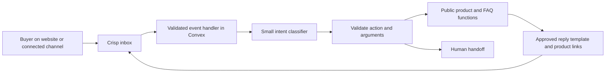

# Current decision — 14 September 2026

Chat is hidden from the website. Keep the existing guide code for now. The owner plans to use OpenRouter later. The provider, model, translation, and inbox proposal below is deferred and must be reviewed before implementation.

# 4. Chat and translation

## Recommended inbox

Trial **Crisp Essentials** first. It has an official [Next.js integration](https://help.crisp.chat/en/article/how-to-install-crisp-chat-widget-on-nextjs-app-xh9yse/). Its managed channels include website chat, WhatsApp Business, and Instagram. This does not require WordPress.

The old WordPress plugin cannot be identified from the description alone. Crisp is a candidate for the required behavior, not a claim that it was the same plugin. A WooCommerce connector will not automatically know about a custom Convex catalogue or orders.

Chatwoot Cloud is an alternative. Its documented [Google Translate flow](https://chatwoot.help/hc/user-guide/articles/1679916448-how-to-translate-your-messages-with-google-translate) uses a per-message Translate action. That does not establish the automatic experience requested here. Do not self-host it in week 1.

## Translation requirements

The buyer writes Arabic. The operator reads English, can inspect the original Arabic, writes an English answer, and previews the Arabic reply before sending. Preserve the original message. Mark translated text as translated.

Crisp documents [live translation in its inbox](https://help.crisp.chat/en/article/getting-started-with-the-crisp-inbox-opv83/) and [Essentials/Plus translation quotas](https://help.crisp.chat/en/article/what-happens-when-my-livetranslate-weekly-quota-is-reached-1hcbmaj/). The exact original-message control, Arabic behavior, and behavior across each channel still require a trial. Marketing pages are not acceptance evidence.

| Trial | Pass condition |
| --- | --- |
| Website Arabic message | Operator gets a readable English translation |
| Original message | Operator can view and copy the original Arabic without losing the translation |
| English reply | Operator can review the Arabic result; buyer receives the intended message |
| WhatsApp | Inbound, outbound, translation, and product links work within permitted messaging rules |
| Instagram | Same checks using the owner's eligible account |
| Page context | Operator can see the current public path and product; query strings and private checkout details are excluded |
| Product link | A message opens the correct live product on mobile |
| Handoff | A human takeover stops bot replies until explicitly returned to the bot |
| Failure or quota | Original message remains readable and the operator sees that translation failed |

Connect only the channels the business uses. Additional channels need an explicit test and may need their own provider account or approval. WhatsApp fees and permitted message windows are separate from the Crisp subscription.

## Small LLM, restricted actions

Model size does not prevent data leaks. The protection is to restrict data and actions outside the model.

Proposed classifier: **Gemini 3.1 Flash-Lite**, using the paid API data terms. The current [model pricing page](https://ai.google.dev/gemini-api/docs/pricing) lists it for low-cost processing. Lock the model ID after a small Arabic/English intent test. The chatbot must still work with human handoff when the model times out or is unavailable.

Use the managed Crisp inbox and translation. Add only a small connector inside the existing Convex backend:

The separate tool layer is a permission boundary in Convex, not another hosted microservice. The model proposes an action. Normal code decides whether it can run.

Allowed first-release actions:

- `findProducts`: search only published product data.
- `getProduct`: return public name, pack, price, availability, and canonical product URL.
- `getPublicAnswer`: select an approved delivery or farm FAQ answer.
- `handoff`: stop automation and notify the operator.

Use deterministic buttons for common requests. The model returns a validated action and limited arguments; it does not create database queries or choose arbitrary network URLs. Reply code builds product links from known slugs. Do not let it invent discounts, medical claims, prices, stock, or delivery promises.

The classifier receives the minimum buyer message and public context. It gets no keys, private notes, past private conversations, order records, or customer lists. Redact obvious contact details before the classifier where possible. Do not use free-tier model settings that allow customer messages to train or improve provider products. See [Gemini billing and data-use guidance](https://ai.google.dev/gemini-api/docs/billing).

Private order questions go to a secure order page or a human. Chat session IDs, claimed emails, and phone numbers are not account authentication.

## Integration limits and proof

- Check production API token access and the required Crisp event mechanism during the trial. Use authenticated events, or re-fetch a referenced event from the provider before acting if that event type lacks signature verification.
- Accept only events for the configured workspace and inbox. Validate schemas and size limits. Deduplicate provider message IDs.
- Ignore operator, bot, and internal-note events to prevent reply loops.
- Store only delivery/deduplication and handoff state in Convex. Crisp remains the conversation store.
- Bound message length, model time, output size, retries, and calls per visitor. Never use an unbounded agent loop.
- Human takeover cancels pending bot replies. Recheck takeover state before sending a delayed result.
- Crisp documents [backend messaging](https://help.crisp.chat/en/article/how-to-send-messages-from-your-backend-n94aue/) and [workflow product carousels](https://help.crisp.chat/en/article/how-to-create-product-carousels-with-workflows-46qf6x/). Use plain product links first.
- Native external AI task features may need a different plan. Do not assume every AI feature is included in Essentials. Prove the small REST/webhook connector before accepting its one-day implementation estimate.

## Abuse tests before enabling bot replies

Test requests for secrets, customer lists, another buyer's order, internal prompts, refunds, malicious URLs, fake prices, oversized text, mixed Arabic/English, and instructions hidden in product text. Also test unknown products and provider failure. The pass condition is a safe public answer or human handoff, with no private data or unauthorized action.
