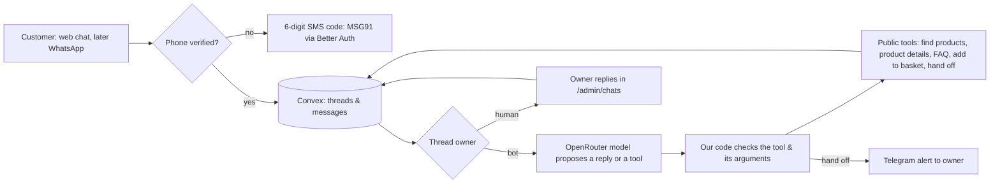

# Support chatbot

## 6 October 2026 release plan

Owner requested implementation and production tests: improve the public chat and team inbox, make team replies live, add an unread badge, real typing dots, new chats and history, align the launcher with the cart, hide testimonials, and bypass Vercel image optimisation.

- Goal: a visitor and the team see the same saved conversation without a reload or a ten-second timer.
- Architecture: Convex remains the only chat store. Next.js keeps visitor and admin cookies httpOnly and forwards authenticated Convex query subscriptions as server-sent events. No credentials or private session cookies enter browser JavaScript. Native browser EventSource reconnects after a dropped connection.
- Alternatives: faster polling still delays replies; exposing the cookie to a browser Convex client weakens the current identity boundary. The server subscription reuses the current server secrets and session checks.
- Compatibility: existing conversations keep their token ownership. An optional browser-session ID separates new conversations without deleting old records. The old HTTP read routes remain available for existing deployed clients during release.
- Session definition: one browser tab session survives page changes and reloads. A new browser session starts a new conversation; a visitor can also start one manually or open their own history. No login gate is added.
- Typing: save only an expiry time, never an unsent draft. Show dots only while that time is live. Honour reduced motion.
- Lifecycle: close inactive chats after three days. Archive is reversible and hides chats from the active team inbox. It does not delete messages; the existing 180-day retention rule remains.
- Change necessity: code-change. The current ten-second, owner-only polling cannot satisfy the live reply requirement. The chat store owns lifecycle and authorization; small transport and UI modules own live delivery and presentation.
- TDD Route: mode off, strict steps skipped. Add backend authorization, ownership, session, typing and lifecycle regression tests, then run all tests, lint, typecheck and build.
- Execute inline: extend the backend; add the authenticated live transport; improve visitor controls and team inbox; verify locally; deploy Convex first; commit and push main; verify Vercel READY and both sides of a production test conversation.
- Release risks: stream reconnection, a team takeover during an AI stream, wrong-conversation replies, expired admin sessions, mobile cart overlap. Test these boundaries. Remove the old ten-second reply timer; do not keep a second delivery owner.

Research: [Intercom inbox](https://www.intercom.com/help/en/articles/6258745-the-inbox-explained), [Zendesk conversation interface](https://support.zendesk.com/hc/en-us/articles/4408823962906-Understanding-the-conversation-interface-for-agents), [Convex subscriptions](https://docs.convex.dev/client/javascript/overview).

Status, 28 September 2026: **steps 2 and 3 are built** (owner request: "implement … open router sdk or vercel ai sdk, whichever provides us the best"). The chat stays hidden until the owner turns it on in `/admin`. Step 1 (SMS-code sign-in) waits for MSG91 and DLT. Costs and providers: [research](23-notifications-otp-chat-research.md). Earlier design: [chat & translation](04-chat.md).

## What is built

- **Stack.** The Vercel AI SDK 7 (`ai`, `@ai-sdk/react`) with the official OpenRouter provider (`@openrouter/ai-sdk-provider`). The AI SDK gives streaming replies, typed tools and the `useChat` window; OpenRouter gives one key for every model, a fallback model and a spending cap. Models (owner choice, 28 September 2026): `openai/gpt-6-luna` first, for reliable tool use on hosts that do not train on chats; `google/gemini-3.1-flash-lite` as the backup, the strongest on the site's languages. Change them with `OPENROUTER_MODEL` / `OPENROUTER_FALLBACK_MODEL`. Only providers that do not keep or train on prompts are used (`data_collection: deny`). Replies are capped at 500 tokens, 4 tool steps and minimal reasoning.
- **Where it runs.** `app/api/chat/route.ts` on Vercel. The key `OPENROUTER_API_KEY` is a Vercel server variable; the browser never sees it. Without the key, the switch shows the old English catalogue guide.
- **Tools, checked by code** (`lib/chat-bot.ts`): `findProducts`, `getProduct`, `addToBasket`, `lookupOrder` and `handOff`. Prices, packs and stock come from the live catalogue for the visitor's country. `addToBasket` only offers a button; the customer taps it. `lookupOrder` needs both the exact order reference and checkout phone, then returns only that order's reference, status and items. It cannot search or list by phone, address or name. The model has no database, payment or web access.
- **Languages.** It answers in the visitor's language on all 32 site versions, including Hindi and other Indian languages typed in Latin letters. Search knows common local names (palak, dhaniya, pudina, methi, tulsi and more).
- **Storage** (`convex/chat.ts`): `chatThreads` and `chatMessages`. A chat belongs to a private, httpOnly cookie; Convex stores only its SHA-256. Chats are deleted 180 days after the last message by a daily job (`convex/crons.ts`).
- **Hand-off.** Code hands the chat to the owner for "person / call me / where is my order / refund / complaint" (English and common Hinglish); the model can also hand off, and a failed answer hands off too. The owner gets a Telegram alert with a link.
- **Owner inbox.** `/admin/chats`: a live two-pane inbox with search, filters, unread marks, saved replies, **Take over**, **Return to AI**, **Close** and reversible **Archive** for chats inactive for three days. Cookie-authorized Convex subscriptions deliver saved messages without a reload or a polling timer, including while the visitor's chat window is closed.
- **Limits.** 300 characters a message (the chat box shows a counter near the end); 30 messages an hour per address and per chat, 600 an hour in total.
- **Cost tracking and budget.** OpenRouter reports the cost of each model call; each chat keeps its cost, tokens and reply count, and `/admin/chats` shows them, with "Most expensive" sorting to spot a spammer. `/admin` shows the month's spend. A chat that costs more than US$0.05 in a day goes to the owner. When the month's spend reaches US$5, the assistant pauses for everyone, customers see a short notice, and the owner gets one Telegram alert; it resumes on the 1st (India time) or when the limit is raised. Change the limits with `CHAT_MONTHLY_BUDGET_USD` and `CHAT_DAILY_LIMIT_PER_CHAT_USD` in Convex. Also set a US$5 monthly limit on the OpenRouter key itself.
- **Tests.** `tests/chat.test.ts` uses the AI SDK's mock model: tool checks, a streamed tool call, hand-off rules, and the route's refusals. `tests/chat-backend.test.ts` checks browser sessions, private history, live-query access denial, team takeover, typing expiry, three-day closure and reversible archives. On 6 October, a local browser test verified a team reply without a reload, typing dots, the unread badge, history, and matching cart/launcher bottom edges at 390px and 1280px.

## Owner setup

1. Create an OpenRouter account, add US$5–10 of credit, and set a **US$5 monthly limit** on the key.
2. Put the key in Vercel → floruvi → Settings → Environment Variables: `OPENROUTER_API_KEY`, Production, Sensitive. Redeploy.
3. Update the privacy notice: chats are saved for 180 days and processed by OpenRouter and the model provider.
4. Deploy the backend: `pnpm exec convex deploy` (answer `y`).
5. Turn **Website chat** on in `/admin`, try 20–50 real questions in English, Hindi and Arabic, and read them in `/admin/chats`.

Still to build: SMS-code sign-in before chatting (step 1), and WhatsApp (step 4).

Owner decision, 28 September 2026: the chat uses OpenRouter only. A model on the farm's own phone (Gemma on a Pixel 9) was considered and dropped: it would save only about ₹100 a month, with weaker answers in Hinglish and a phone server to maintain.

## What the owner asked for

A website chat that works only after the customer verifies a 10-digit mobile number with a 6-digit SMS code. The bot answers only Floruvi questions, knows every product and price, can add products to the basket, explains payment and delivery, and hands the chat to the owner when a person is needed ("Where is my order?", "I want to talk to a human"). The owner answers from the admin panel. All chats are stored. Later, the same bot runs on WhatsApp. The budget is small.

## Original design (approved by the owner on 28 September 2026)

1. **Identity.** The same phone sign-in as checkout (backlog item 5): Better Auth's phone-number plugin with the Convex component, MSG91 for SMS. The phone number is the customer ID. No email. WhatsApp chats are already tied to a phone number, so they need no SMS code.
2. **Storage.** Two Convex tables: `chatThreads` (customer, channel, who is answering: bot / owner / closed, last message time) and `chatMessages` (thread, author: customer / bot / owner, text, time). The owner sets a retention period (proposal: delete after 180 days). This is the only chat store — no second inbox service.
3. **The bot.** A Convex action runs after each customer message while the bot owns the thread. It sends the fixed rules, a short summary of older messages, the last 6 messages and 5 tools to OpenRouter.
   - Model: `qwen/qwen3.7-flash` first (about US$0.61 per 1,000 conversations), with `openai/gpt-6-luna` as the fallback. Keep the choice only after a 50-question test in English, Hindi and Arabic; use `google/gemini-3.1-flash-lite` if those fail.
   - Replies are capped near 300 tokens; at most 5 products per answer; lowest reasoning setting; prompt caching on.
4. **Tools, checked by our code — never by the model.**
   - `findProducts(text)` and `getProduct(slug)`: published products only, with the real price, pack & stock status. Prices always come from these tools, never from the model's memory.
   - `faq(topic)`: the delivery, payment, boxes & returns answers already on the site.
   - `addToBasket(slug, quantity)`: our code checks the product exists, is in stock and the quantity is 1–99, then the chat window adds it to the customer's basket and shows the cart pill.
   - `handOff(reason)`: gives the thread to the owner and sends a Telegram alert.
   - The model gets no database access, no order data, no payment actions and no web access (AGENTS.md).
5. **Hand-off rules.** Code, not the model, hands off on: "human / person / agent / call me", any order-status or refund question, an angry or unclear conversation after 2 failed answers, or a model error. While the owner owns the thread the bot is silent; the owner can hand it back.
6. **Admin inbox.** `/admin/chats`, behind the existing admin sign-in: open threads first, live updates, reply box, "take over" and "give back to bot" buttons.
7. **Minimal interface (owner request, 28 September 2026).** A small round chat button (bottom corner, clear of the cart pill), and a plain panel: title, "automated" note, messages, one input line. Product answers are simple links, and "Add to basket" is a single button. No avatar, banner or footer text. It loads only after the page is idle.
8. **On/off switch (built 28 September 2026).** The admin panel's "Website chat" switch shows or hides the chat for all visitors; it is hidden by default. Today it shows the existing catalogue guide (English versions only, no AI, no sign-in). The bot in this plan will use the same switch.
7. **Limits & cost control.** Per phone: 30 messages an hour and 100 a day. A site-wide daily token budget; when it is used up, new chats go to the owner. An OpenRouter monthly spend cap (proposal: US$10). SMS codes use the checkout limits.
8. **Safety tests before launch.** The abuse tests in [chat & translation](04-chat.md), plus prompt-injection attempts ("ignore your rules", fake prices, requests for other customers' data). The bot must stay on Floruvi topics and refuse the rest in one short line.
9. **WhatsApp (later).** A Meta WhatsApp Cloud API webhook into the same threads. From 1 October 2026 each business number gets 1,000 free service replies a month in India, then ₹0.115 each. Business-started template messages cost extra.

## Build order

| Step | Work | Needs from the owner |
| --- | --- | --- |
| 1 | Phone sign-in with SMS code (shared with checkout) | MSG91 account, DLT registration (entity, header, OTP template) |
| 2 | Chat storage, website chat window, admin inbox — owner answers only | Retention period; privacy notice wording |
| 3 | Bot with the 5 tools, hand-off & limits | OpenRouter key & monthly cap; approve the model after the language test |
| 4 | WhatsApp channel | Meta business verification & a phone number |

Steps 2 and 3 can be built before step 1 is live by using a test sign-in in development only.

## Monthly cost at 1,000 chats (rough)

- Model: about US$0.40–2 (Qwen, cached) — well under the proposed US$10 cap.
- SMS codes: about ₹0.30 each with MSG91 → about ₹300 for 1,000 sign-ins.
- WhatsApp (later): free for the first 1,000 service replies a month per number.

## Decisions needed

1. Approve this design and the build order.
2. Confirm phone-only sign-in for customers (this replaces the email + phone codes in AGENTS.md).
3. Chat retention period, and the OpenRouter monthly cap.
4. Which languages the bot should answer in at launch.
