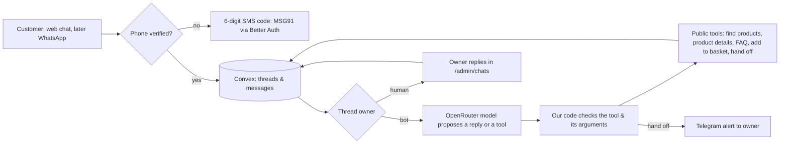

# Support chatbot — plan for owner approval

Status: proposal, 28 September 2026. Nothing below is built. Costs and providers: [research](23-notifications-otp-chat-research.md). Earlier design: [chat & translation](04-chat.md).

## What the owner asked for

A website chat that works only after the customer verifies a 10-digit mobile number with a 6-digit SMS code. The bot answers only Floruvi questions, knows every product and price, can add products to the basket, explains payment and delivery, and hands the chat to the owner when a person is needed ("Where is my order?", "I want to talk to a human"). The owner answers from the admin panel. All chats are stored. Later, the same bot runs on WhatsApp. The budget is small.

## Recommended design

1. **Identity.** The same phone sign-in as checkout (backlog item 5): Better Auth's phone-number plugin with the Convex component, MSG91 for SMS. The phone number is the customer ID. No email. WhatsApp chats are already tied to a phone number, so they need no SMS code.
2. **Storage.** Two Convex tables: `chatThreads` (customer, channel, who is answering: bot / owner / closed, last message time) and `chatMessages` (thread, author: customer / bot / owner, text, time). The owner sets a retention period (proposal: delete after 180 days). This is the only chat store — no second inbox service.
3. **The bot.** A Convex action runs after each customer message while the bot owns the thread. It sends the fixed rules, a short summary of older messages, the last 6 messages and 5 tools to OpenRouter.
   - Model: `qwen/qwen3.7-flash` first (about US$0.61 per 1,000 conversations), with `openai/gpt-6-luna` as the fallback. Keep the choice only after a 50-question test in English, Hindi and Arabic; use `google/gemini-3.1-flash-lite` if those fail.
   - Replies are capped near 300 tokens; at most 5 products per answer; lowest reasoning setting; prompt caching on.
4. **Tools, checked by our code — never by the model.**
   - `findProducts(text)` and `getProduct(slug)`: published products only, with the real price, pack & stock status. Prices always come from these tools, never from the model's memory.
   - `faq(topic)`: the delivery, payment, boxes & returns answers already on the site.
   - `addToBasket(slug, quantity)`: our code checks the product exists, is in stock and the quantity is 1–99, then the chat window adds it to the customer's basket and shows the cart pill.
   - `handOff(reason)`: gives the thread to the owner and sends a Telegram alert.
   - The model gets no database access, no order data, no payment actions and no web access (AGENTS.md).
5. **Hand-off rules.** Code, not the model, hands off on: "human / person / agent / call me", any order-status or refund question, an angry or unclear conversation after 2 failed answers, or a model error. While the owner owns the thread the bot is silent; the owner can hand it back.
6. **Admin inbox.** `/admin/chats`, behind the existing admin sign-in: open threads first, live updates, reply box, "take over" and "give back to bot" buttons.
7. **Minimal interface (owner request, 28 September 2026).** A small round chat button (bottom corner, clear of the cart pill), and a plain panel: title, "automated" note, messages, one input line. Product answers are simple links, and "Add to basket" is a single button. No avatar, banner or footer text. It loads only after the page is idle.
8. **On/off switch (built 28 September 2026).** The admin panel's "Website chat" switch shows or hides the chat for all visitors; it is hidden by default. Today it shows the existing catalogue guide (English versions only, no AI, no sign-in). The bot in this plan will use the same switch.
7. **Limits & cost control.** Per phone: 30 messages an hour and 100 a day. A site-wide daily token budget; when it is used up, new chats go to the owner. An OpenRouter monthly spend cap (proposal: US$10). SMS codes use the checkout limits.
8. **Safety tests before launch.** The abuse tests in [chat & translation](04-chat.md), plus prompt-injection attempts ("ignore your rules", fake prices, requests for other customers' data). The bot must stay on Floruvi topics and refuse the rest in one short line.
9. **WhatsApp (later).** A Meta WhatsApp Cloud API webhook into the same threads. From 1 October 2026 each business number gets 1,000 free service replies a month in India, then ₹0.115 each. Business-started template messages cost extra.

## Build order

| Step | Work | Needs from the owner |
| --- | --- | --- |
| 1 | Phone sign-in with SMS code (shared with checkout) | MSG91 account, DLT registration (entity, header, OTP template) |
| 2 | Chat storage, website chat window, admin inbox — owner answers only | Retention period; privacy notice wording |
| 3 | Bot with the 5 tools, hand-off & limits | OpenRouter key & monthly cap; approve the model after the language test |
| 4 | WhatsApp channel | Meta business verification & a phone number |

Steps 2 and 3 can be built before step 1 is live by using a test sign-in in development only.

## Monthly cost at 1,000 chats (rough)

- Model: about US$0.40–2 (Qwen, cached) — well under the proposed US$10 cap.
- SMS codes: about ₹0.30 each with MSG91 → about ₹300 for 1,000 sign-ins.
- WhatsApp (later): free for the first 1,000 service replies a month per number.

## Decisions needed

1. Approve this design and the build order.
2. Confirm phone-only sign-in for customers (this replaces the email + phone codes in AGENTS.md).
3. Chat retention period, and the OpenRouter monthly cap.
4. Which languages the bot should answer in at launch.
