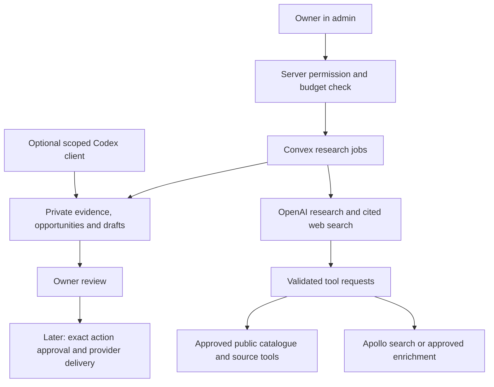

# 31. Floruvi growth system

Status: **built 2 October 2026; provider setup required**. The owner asked for the admin system to work after provider setup and added Exa and Codex access. Provider entitlement, paid execution and channel admission remain separate checks.

## Implementation checkpoint — 2 October 2026

- Goal: ship a working owner Growth workspace with all buyer groups, persisted research/opportunities/drafts/supply details, OpenAI + optional Exa + Apollo adapters, channel readiness and protected Codex access. Keep external sending and bidding owner-controlled in vendor tools.
- Baseline: `28b3f17` on `main`, clean before this build. This contains the favicon/design commit and all existing SEO, product-benefit and gallery branch work. `origin/main` is `99de353`; Vercel production currently serves that commit. No other registered Floruvi worktree exists.
- Authority: the owner's follow-up asks to implement the plan in admin, add Exa/Codex, commit/push all work, deploy and clean worktrees. This approves implementation and deployment, not paid provider calls or unsolicited outreach.
- Architecture: reuse the existing protected owner admin transport and live-session checks; all Growth data/functions stay private in Convex. No new login system or public database mutation. The existing custom-session/Better Auth discrepancy remains an explicit auth migration item; do not weaken existing protection or move customer identity ownership in this feature.
- Stack: existing Next.js/React/Convex; official provider SDKs where available; the existing admin layout and CSS. No new UI library, queue or database.
- Tests: risk-based regression tests for validation, denied access, job reservation/concurrency, cancellation, duplicate results, provider failure, source integrity and MCP scopes. No strict test-first workflow was requested.
- Tasks: (1) shared schemas and buyer/channel definitions; (2) protected Convex records, jobs, budgets and admin HTTP routes; (3) provider clients with no automatic paid retry; (4) admin views and setup actions; (5) narrow MCP tools; (6) channel feed/measurement readiness; (7) local tests, development checks, independent review, production Convex deploy, Git push, Vercel exact-commit and live checks.
- Ownership: coordinator owns shared contracts, Convex storage/HTTP, integration and Git; UI and provider/MCP tasks may run in parallel on distinct files. Preserve the customer OpenRouter chat and commerce gates.
- Setup boundary: API keys, provider billing/permissions, channel account approval and real supply/certificate data are entered by the owner. Missing setup must produce a useful disabled state, never fake results or fake connected status.
- Verification: `pnpm typecheck`, `pnpm lint`, `pnpm test`, `pnpm build`; protected backend denial and workflow checks on development; live page/icon/feed checks after deployment. No production seed or customer mutation as a test.


## Setup the built workspace

Local checks on 2 October 2026: all 110 automated tests, TypeScript, ESLint and the standard Next.js production build passed (473 generated pages). Independent review fixes cover branch deduplication, employer changes, MCP draft retries, contact redaction and retained uncertain costs. Development checks confirmed the signed-out redirect and the authenticated desktop Growth screen. The temporary session was revoked. Narrow-mobile acceptance, browser form-save acceptance and live paid provider execution remain unverified. Production and exact-commit verification are separate release checks.

1. Open `/admin/growth`. Add dispatch location, products, capacity, delivery, certificates and commercial terms. Blank fields remain unknown.
2. Add `OPENAI_API_KEY` in the **Convex production** environment. Add `EXA_API_KEY` for optional Exa source search and `APOLLO_API_KEY` for contact research. Keys never go in a browser form or Git.
3. In Channels, test OpenAI and Apollo access. Exa has no free authenticated test in this adapter; its setup remains unverified until an owner-started search succeeds. Configuration is not access proof.
4. Set `GROWTH_MONTHLY_BUDGET_USD` in Convex (default 10), then `GROWTH_RESEARCH_ENABLED=true` when ready for paid runs. Start a small buyer, tender or export run and review the sources. Research works before social or analytics setup.
5. For paid Apollo contact checks, set `GROWTH_APOLLO_MONTHLY_CREDITS` after checking the actual plan. Search a named company and domain first. Select a person and confirm the possible charge. No address is sent to outreach tools.
6. Optional Codex access: generate a dedicated random token of at least 32 characters. Set the same `GROWTH_MCP_TOKEN` in Vercel and Convex; it must differ from `ADMIN_API_SECRET`. Redeploy Vercel after an environment change. Set the local `FLORUVI_GROWTH_MCP_TOKEN` environment variable without putting its value in config or chat, then use:

```toml
[mcp_servers.floruvi_growth]
url = "https://floruvi.com/api/growth/mcp"
bearer_token_env_var = "FLORUVI_GROWTH_MCP_TOKEN"
```

7. Google Merchant: review eligible India offers, genuine product photos, checkout, shipping and returns. Set `GROWTH_MERCHANT_FEED_ENABLED=true` in Convex only after live Razorpay and listing requirements work. Submit `/feeds/google.xml` as a scheduled feed in the verified Merchant account. The feed excludes boxes, exports and offers with missing facts. An enabled feed is not Merchant approval.
8. Use Channels for official portal links and owner readiness notes. Marketplace admission, account linking, certifications and social setup are manual provider steps. GA4/PostHog event delivery and consent controls remain later implementation; these cards do not collect analytics.

The first workspace displays the latest 200 opportunities, 30 runs and 100 drafts. These are bounded views, not a complete CRM. Sources and contacts remain candidates until checked. Review/delete draft text in admin; a future retention job for research/contact records remains in the backlog.

## Current direction

**Owner decisions, 2 October 2026:** plan a growth and research system inside Floruvi admin. Include Google Merchant Center, Google Analytics, PostHog, OpenAI/ChatGPT/Codex access, Apollo, social channels and future sales support. Cover **all buyer groups**, including military contracts and large institutions. Group the options so the owner can compare them.

This replaces the 29 September proposal to keep all research on a separate laptop. The older research remains in the archive below. Its prices, legal summaries and dates need a fresh check before use. This document owns the design and setup instructions. The follow-up authorizes implementation and deployment. Paid usage, outreach and bids need their own setup and owner action.

**Implemented:** one **Growth** entry in `/admin`. Start with cited research, a grouped opportunity list, channel setup and a draft queue. Keep business rules and records in Convex. Add sales delivery only after the owner approves exact actions and the providers work.

| Approach | Benefit | Cost or limit |
| --- | --- | --- |
| Vendor tools and a spreadsheet | Fastest start; little code | Evidence, prospects and website results stay separate |
| **Small Growth workspace in Floruvi — recommended** | One buyer map, research history, evidence and next step | Needs protected data, spend limits and a few provider links |
| Full CRM and autonomous sales agent | More automation | Too much scope before supply, demand and provider access are proved |

## 1. Buyer map: keep every route visible

These are **sales routes to research**, not confirmed buyers or purchase demand. Show all groups from the start. Let the owner filter by product, city, country, volume, buying route and readiness. “Research now” does not mean “ready to supply”.

| Group | Buyer types | Person or route to find | Main qualification check |
| --- | --- | --- | --- |
| Homes and communities | Households, apartment groups, employee produce clubs, weekly-box buyers, farmers' markets | Resident association, community organiser, direct enquiry | Basket margin, repeat demand and delivery cost; boxes remain enquiries |
| Restaurants and hospitality | Restaurants, cafés, cloud kitchens, QSR chains, hotels, resorts, wedding and event caterers | Chef, purchasing manager, central kitchen or approved distributor | Crop specification, sample approval, frequency and delivery window |
| Corporate and industrial kitchens | Office campuses, IT parks, factories, business parks, worker canteens | Catering contractor first; procurement team if it buys produce directly | Who pays, site volumes, supplier approval and credit period |
| Health, education and care | Hospitals, medical colleges, schools, colleges, hostels, elder-care homes, sports academies, wellness resorts | Kitchen operator, purchasing team or food-service contractor | Hygiene, traceability, approved specifications and reliable supply; no health claims |
| Defence and public institutions | Army supply depots and messes, other defence establishments, CAPF/police kitchens, public hospitals, universities, welfare hostels, prisons, municipal kitchens | Official tender, registered supplier route or an existing catering/supply contractor | Exact tender eligibility, deposits, inspection, delivery duties and payment terms |
| Transport catering | Railway base kitchens, railway caterers, airport/airline kitchens, other contracted passenger catering | Actual catering operator or tender issuer | Vendor approval, cold chain, site access and strict delivery slots |
| Retail and commerce | Organic/gourmet stores, supermarkets, neighbourhood grocers, online grocers, quick-commerce chains, produce subscription brands | Category buyer, regional sourcing team or seller onboarding | Margin, rejection/return terms, packing, shelf life and channel admission |
| Wholesale and aggregation | Mandis, produce wholesalers, HoReCa distributors, food-service aggregators, farmer-producer organisations | Produce buyer or sourcing manager | Price, grading, minimum lot, payment security and aggregation terms |
| Processing and private label | Salad and meal brands, juice makers, pickle/sauce makers, frozen-food firms, dehydrators, powder makers, private-label packers | Procurement, quality or contract-manufacturing team | Usable grade, food safety, specification, measured yield and processing cost |
| Export | Importers, overseas wholesalers, retail buyers, hospitality distributors, Indian merchant exporters and commission agents | Verified importer/buyer, exporter or sales agent | Product-country rules, actual buying role, trial size, logistics, payment and commission terms |
| Social and community kitchens | School-meal operators, charitable kitchens, community meal programmes | Central procurement or approved contractor | Whether this is a paid procurement route, quality rules and price fit |

**Look for the buyer behind the institution.** A hospital or campus may buy a catering service while its contractor buys the vegetables. Research both entities and record the relationship. Compass India describes supplier approval and sourcing of vegetables and microgreens. Sodexo describes local farm sourcing. Akshaya Patra describes supplier checks and daily fresh-vegetable procurement. These prove that the route exists; they do not prove that Floruvi is accepted or that an open requirement exists. [Compass sourcing](https://compass-group.co.in/sourcing/), [Sodexo local sourcing](https://www.sodexo.in/blog/local-food-sourcing), [Akshaya Patra kitchens](https://odisha.akshayapatra.org/our-kitchens).

**Product fit matters.** Research premium herbs, microgreens and edible flowers for buyers that use them. Research staple vegetables for bulk kitchens. Do not assume a large tender pays an organic premium. Match every opportunity to weekly available kilograms and delivery capacity before ranking it as ready.

## 2. Channels and platforms

“Link/manual” means the admin holds a source link, checklist and status. It does not mean the platform has an available API or that Floruvi has a partnership. Provider admission, payment and local service coverage remain separate checks.

| Channel | First use | Connection plan and gate |
| --- | --- | --- |
| Google Search Console and Bing Webmaster Tools | Search visibility, sitemap and indexing | Link/manual verification first; add read-only reporting only if it helps a decision |
| Google Business Profile | Local discovery where Floruvi is eligible | Owner verifies the real business and in-person service model; online-only status is not enough. [Eligibility](https://support.google.com/business/answer/13763036) |
| Google Merchant Center | Eligible product listings and later Shopping ads | A gated catalogue feed is built at `/feeds/google.xml`. Activate only after real purchase, price, shipping and return details work. Use Merchant API if API management is later needed. [Free listings](https://support.google.com/merchants/answer/9199328), [Merchant API](https://developers.google.com/merchant/api/overview) |
| Google Analytics 4 and PostHog | Acquisition and website conversion | One event contract, two defined reporting roles; see section 6. Setup is requested, connection is unverified |
| Instagram, Facebook, Meta catalogue and WhatsApp Business | Product discovery, catalogues and inbound enquiries | Link/manual setup first. Use official account and catalogue routes. Do not assume that Shops or checkout are available for this account and market |
| Buffer or Meta Business Suite | Draft and schedule social posts | Use existing vendor tools first. Add a publish connector only after social accounts, permissions and exact-content approval work |
| Hyperpure and Udaan | Food-service or trade distribution | Research supplier admission, supported categories and service cities. Hyperpure has a [seller portal](https://seller.hyperpure.com/); acceptance and terms need direct confirmation |
| IndiaMART, TradeIndia and ExportersIndia | Business enquiries and supplier visibility | Owner-managed profile and reply process. Check lead quality before buying plans; no scraping or assumed lead API |
| ONDC | Reach buyers through the network | Join through a suitable seller network participant; compare produce support, settlement, fees and logistics. Do not build a full network participant. [Seller route](https://www.ondc.org/pages/seller-network-participants.html) |
| BigBasket, Blinkit, Zepto, Instamart, JioMart and retail chains | Larger retail distribution | Supplier onboarding research. Confirm each category, local intake, packing, margins, returns and payment terms before a pilot |
| GeM, CPPP, Defence eProcurement and Karnataka KPPP | Government and institutional opportunities | Official notice research and bid-readiness checklist first. Owner completes registration, DSC, deposits and bid submission through the relevant portal |
| APEDA AgriExchange, DGFT Trade Connect and FIEO | Export markets, trade leads and buyer events | Source links and research. Confirm current access, product-country requirements and actual buyer identity |
| Alibaba.com and trade fairs such as Gulfood | International buyer and distributor discovery | Research and compare costs first. No paid membership or event booking until export supply and buyer fit are proved |
| Apollo | Organisations and purchasing contacts | Optional API behind server checks. Search first; owner selects records for credit-consuming enrichment. See section 5 |

**Merchant readiness:** an enquiry path is not a completed purchase flow. The code includes Razorpay, but live payment readiness was not checked in this task. Do not submit enquiry-only boxes or quote-only international offers as immediately purchasable items. Keep stable product IDs, canonical country/language URLs, actual price and currency, pack size, stock, image, shipping and return data aligned with the page. Convex owns these facts. Never invent GTINs. The initial feed should include only offers that meet Google's purchase and product requirements. [Checkout requirements](https://support.google.com/merchants/answer/9158778).

New API work must use Merchant API. The legacy Content API sunset date was 18 August 2026. A scheduled feed is a smaller first step than an API sync. [Merchant API updates](https://developers.google.com/merchant/api/latest-updates).

Correction to the older research: Google does not ban all generated product images. Its image specification requires accurate images and the required generative-AI metadata where applicable. Real product photos remain the preferred Floruvi sales evidence. [Image requirements](https://support.google.com/merchants/answer/6324350).

## 3. Defence, government and large contracts

Keep two routes visible: **bid directly** and **supply an approved contractor**. The second can be a practical entry point if a direct contract needs capacity, experience or working capital that Floruvi cannot yet prove. Subcontracting or resale must be permitted by the actual agreement.

Army fresh-food supply and CSD retail product introduction are different routes. Research ASC/supply-depot requirements through official procurement notices. CSD has its own product-introduction process and must not be shown as the default route for supplying fresh vegetables to the Army. [Defence portal](https://defproc.gov.in/nicgep/app), [CSD process](https://www.csdindia.gov.in/faq.html).

Source register: [GeM seller guide](https://assets-bg.gem.gov.in/resources/pdf/seller-user-manual.pdf), [CPPP](https://eprocure.gov.in/epublish/app), [Karnataka KPPP](https://kppp.karnataka.gov.in/). An official [Mangalore University archive](https://www.mangaloreuniversity.ac.in/tender-notifications-2022-23) includes hostel vegetable procurement; it is historical evidence of the route, not a current open bid.

The research job should search crop names and terms such as fresh vegetables, leafy vegetables, fresh fruits, ration supply, hostel provisions and kitchen supplies. It should separate produce supply from catering contracts, equipment tenders and expired notices.

Each tender record must show:

- Issuer, official notice URL, tender reference, document version, checked date and amendments.
- Product/grade, quantity and period, delivery sites and frequency. Missing values stay unknown.
- Closing date, timezone and any pre-bid date; recheck the portal before taking action.
- Registration, tax, food-safety, turnover, past-supply and certification requirements as written in that tender.
- Bid fee, earnest-money deposit, performance security, payment cycle, rejection rules and penalties where stated.
- Floruvi's evidence for each requirement: met, missing evidence, not met, or not applicable.
- Route: direct bid, contractor-supply lead, research only, expired, or rejected with reason.

Do not infer a blanket startup/MSME exemption. Check the tender. Do not rank a large contract as attractive without delivery costs, rejection exposure, credit period and required working capital. The assistant prepares a bid checklist and questions; it does not sign, pay deposits or submit bids.

## 4. What the admin should do

The existing order overview remains. **Growth** has four views:

1. **Opportunities:** grouped buyers and separate tender records. Filters: group, product, location, buying route, readiness and last checked. Each row shows business, role, contact status, source, reason to approach and next step.
2. **Research:** start a bounded job; view progress, sources, spend and errors. Job types: buyers, tenders, export brief and later channel review. Select all groups or a subset. A group with no verified results must stay visible.
3. **Channels:** setup checklist, official portal, connected account, permission state, last provider test, last successful sync and errors. Use “not configured”, “configured”, “access tested”, “working” and “error” truthfully. A saved key is not proof of access.
4. **Drafts and results:** sample offers, supplier introductions, product sheets and questions for the buyer. Later show approved outreach, replies, qualified enquiries and confirmed sales. A draft is not a sent message.

Example requests:

- “Find buyers for basil and leafy vegetables across all buyer groups in Karnataka. Group the results and show how to approach each.”
- “Find official fresh-vegetable tenders for defence, hospitals and hostels. Show deadlines, deposits and missing eligibility evidence.”
- “Find the catering firms serving these campuses and the produce purchasing role.”
- “Compare UAE and UK buyer routes for this product. Cite current official export/import requirements and list what still needs confirmation.”
- “Which channels brought qualified enquiries and paid orders this month? Suggest one test within my stated budget.”

Use a short supply profile: origin/dispatch location; available crops and weekly kilograms; seasonal limits; grades and packs; delivery capability; minimum order; approved prices; certificates and expiry dates; buyer credit limit; export readiness. Unknowns stay visible. Research can cover all India and the supported export countries; this must not introduce a storefront PIN-code restriction.

Rank with visible reasons: product fit, repeat demand evidence, delivery fit, reachable buying role, margin after costs, payment risk and eligibility. Keep **commercial fit** separate from **evidence confidence**. A model score is not proof that a buyer will purchase. Keep strategic larger accounts alongside near-term prospects.

For organic claims, store the certificate issuer, scope, product, operator, dates and evidence. Do not assume that hydroponic production, a lab test or “chemical-free” proves organic certification. Check the applicable certification and labelling route; the FSSAI portal explains NPOP and PGS. Export acceptance needs a separate destination check. [Jaivik Bharat](https://jaivikbharat.fssai.gov.in/index.php).

## 5. OpenAI, Codex and Apollo design

**Implemented:** one OpenAI Responses API integration for admin research. Keep the existing Vercel AI SDK + OpenRouter customer chat unchanged and hidden until the owner enables it. The research assistant has a different purpose, permissions and budget; it does not reuse customer chats.

The owner reports existing ChatGPT/Codex access. That does not verify Floruvi's server API entitlement or funded balance. Standard API-key use follows API pricing. The current ChatGPT-plan-use preview documents an open-source/local-app route and directs hosted apps to a separate interest process. Do not promise subscription-funded research in the hosted Floruvi admin. [OpenAI pricing](https://learn.chatgpt.com/docs/pricing), [ChatGPT plan access](https://developers.openai.com/siwc/token-sharing-open-source).

Use a dedicated project key in Convex server variables. The bounded adapter currently uses `gpt-5-mini`; test account access before enabling paid runs. A model change needs a reviewed cost bound. Use built-in web search for cited research. Use strict function schemas and application checks for Apollo and catalogue tools. This version uses a Convex scheduled action, a provider timeout and a five-minute job expiry. It makes no automatic paid retries. Background responses are a later option. [Web search](https://developers.openai.com/api/docs/guides/tools-web-search), [Function calling](https://developers.openai.com/api/docs/guides/function-calling), [Background mode](https://developers.openai.com/api/docs/guides/background).

**Apollo is one source, not the whole research system.** It can help with hotel groups, caterers, distributors and importers. Verify the branch or delivery location because company-headquarters location can differ. People Search does not return email addresses or phone numbers. Organisation search and enrichment can consume credits; account eligibility and legacy-plan rules vary. Search first, then approve selected enrichment. Keep personal-email, mobile-reveal and waterfall options off initially. Use endpoint-scoped keys where supported. [People search](https://docs.apollo.io/reference/people-api-search), [Organisation search](https://docs.apollo.io/reference/organization-search), [Enrichment](https://docs.apollo.io/reference/people-enrichment), [API keys](https://docs.apollo.io/docs/create-api-key).

**Codex access is built:** the optional protected MCP endpoint exposes only `read_opportunities`, `read_research` and create-only `save_draft`. It uses a dedicated bearer token in Vercel and Convex; it does not accept the shared admin secret. Read results omit contact fields, private notes and session data, with extra email/phone redaction in prose. Treat the remaining public research text as untrusted source material. Draft creation requires an idempotency key. Owner edits stay in admin. No paid research, sending, orders or payment tools are exposed. Rotate both server tokens to revoke clients. ChatGPT connector/OAuth compatibility remains unverified. [Codex MCP](https://learn.chatgpt.com/docs/extend/mcp).



### Data and security boundaries

The current code has a custom owner-session flow in `convex/admin.ts`, `convex/adminHttp.ts` and `lib/admin.ts`. [Doc 25](25-admin-and-order-alerts.md#security) already records that this differs from the Better Auth ownership rule. Do not create a third identity system. Growth reuses the existing owner-session checks, as authorized in this implementation checkpoint. Better Auth migration remains a separate project decision. MCP uses an independently checked dedicated token and cannot expose the current shared admin secret.

Convex owns research runs, buyer candidates, tender opportunities, evidence, drafts, usage and audit records. Buyer candidates are research records; existing inbound enquiries and orders keep their current owners. Link records by ID when a prospect becomes an inbound enquiry. Do not create a second CRM or a duplicate order ledger. A fuller sales pipeline is a later scope decision.

| Record | Minimum design |
| --- | --- |
| Research run | Owner, job type, groups, filters, allowed tools, state, reserved budget, actual usage, provider response ID, start/end, failure code |
| Buyer candidate | Organisation, buyer group, parent/contractor relation, domain, service location, product fit, public business contact, contact source, contact verification status, last checked, next step |
| Tender opportunity | Portal + reference, issuer, official evidence, dates/timezone, amendments, items/quantity, delivery terms, eligibility gaps, review status |
| Evidence and export brief | Source URL, publisher, checked date, short supporting extract, claim, source type, country/product, uncertainty; no invented legal conclusion |
| Draft and audit | Exact draft, related records, revision, actor, tool/result, usage and timestamp; later approval binds recipient, channel, content revision and expiry |

Every protected Convex operation must check identity and permission. Scheduled work must recheck job authorization, revocation and budget. No database credentials, customer order records, payment actions, shell or unrestricted HTTP tools go to the LLM. Treat websites, tender PDFs and provider results as untrusted data. Code validates tool names, argument schemas, source policy, result counts and output. Render sources as text and safe links, not executable HTML. No bulk scraping of Maps, LinkedIn or gated portals; use permitted APIs, assisted review or manual source upload.

Deduplicate buyers by domain plus branch/location and tenders by portal plus reference. Keep provenance when merging; never merge two branches only because they share a brand. Use job IDs and enrichment keys to prevent duplicate scheduling. Internal keys alone cannot prevent a second provider charge. Retry only bounded failures known to precede execution, or calls with documented provider idempotency. For an uncertain timeout, poll a saved provider request ID where supported; otherwise stop for reconciliation and keep the budget reservation. Show partial results. Support cancel, timeout and provider denial. A cancelled job must not schedule more calls.

Store only needed business-contact fields in protected records. Keep them out of Git, analytics and routine logs. Proposal: expire unreviewed candidates after 90 days; review retained lead data every 180 days. Keep the minimum suppression record needed to honour an opt-out. An enrichment match or public address is not consent to marketing. No private prospect documents through public Convex file URLs.

### Spend controls

Paid research starts disabled. Enforced limits: at most 20 candidates per run, 5 runs a day, one active job and a default US$10 monthly budget. Each job reserves US$1 before execution. The adapter caps web-search calls at 4 and output tokens at 4096; the current researched upper bound is below the reservation. Actual model/search usage is recorded when available. Unknown outcomes consume the reservation rather than freeing it for another charged call. Set a separate Apollo credit limit from the actual plan; the default allowance is zero. Each selected enrichment conservatively consumes 9 allowance credits to cover differing plan rules. This is an application allowance, not a claim that Apollo always bills 9 credits. Search results are saved for one hour and bound to the live owner session. Enrichment must still match the selected person and employer; cached mismatches are rejected. Repeated uncertain requests are blocked. The existing customer-chat budget stays separate.

Reserve the worst-case allowed run cost atomically before provider calls. Apply token, search-call and credit caps. Reconcile actual use afterward and keep uncertain charges reserved until resolved. Stop when the provider price cannot be bounded. Do not treat a billing alert as a hard cap. The first version shows recorded run cost and owner review counts. Cost per qualified opportunity is a later report.

## 6. Google Analytics, PostHog and real sales evidence

The owner explicitly requested both tools on 2 October. Update the earlier PostHog-only plan with defined roles: **GA4 for acquisition and Google campaign reporting; PostHog for product use, funnels and errors**. Use one event specification and consent state. Do not add GTM or a third analytics service by default. Provider access, consent setup and production delivery are unverified. [GA4 ecommerce events](https://support.google.com/analytics/answer/12924131), [PostHog privacy](https://posthog.com/docs/privacy).

| Business fact | PostHog event | GA4 event | Authority |
| --- | --- | --- | --- |
| Product viewed | `product_viewed` | `view_item` | Browser after applicable consent |
| Added to basket | `product_added_to_cart` | `add_to_cart` | Browser after applicable consent |
| Checkout started | `checkout_started` | `begin_checkout` | Browser after applicable consent |
| Enquiry saved | `lead_submitted` | `generate_lead` | Successful backend save; no contact fields or message text |
| Payment captured | `order_paid` | `purchase` | Verified backend capture, stable transaction/event ID, deduplicated |
| Refund confirmed | `order_refunded` | `refund` | Confirmed backend/provider event, stable refund ID |

Amounts stay in integer minor units in Convex; analytics adapters convert to the provider's expected units with explicit currency. Client events never prove revenue. Backend events still respect the recorded consent and identifier policy. Keep research, admin, OTP, customer contacts and chat text out of these services. Replay stays off on sensitive pages. Delay analytics scripts until after critical rendering and applicable consent. Check page and referrer fields for query-string leaks.

Save permitted campaign tags and a campaign/opportunity reference with the related enquiry or order; do not put an email or person name in a URL. Reports show traffic, qualified enquiries, sample requests, sample acceptance, first paid order, repeat order, delivery success and contribution after costs where recorded. Show missing costs as unknown. The order/payment record is the revenue authority. Imported institutional or offline outcomes need supporting evidence and must not be counted twice.

The later assistant may compare aggregate results and draft a next test. It must not read private customer records, change prices, publish posts, increase spend or send messages. Implement outreach later with a suppression check, channel permission, recipient validation, exact-content approval, rate limit, idempotency key and delivery receipt. Approval expires when content or recipient changes.

## 7. Build order and acceptance

Foundation, research adapters, contact research, drafts and scoped Codex access are built. The Merchant feed is gated pending sales readiness. The table also records later measurement and sales work; these are not represented as connected integrations.

| Slice | Deliverable | Evidence before the next slice |
| --- | --- | --- |
| 1. Foundation | Resolve owner-auth boundary; add Growth, all buyer groups, channel register, supply profile, protected opportunity records and manual evidence entry | Unauthorized/direct calls denied; records persist; no fake connected states; keyboard and narrow-mobile review |
| 2. Research pilot | OpenAI buyer/tender/export jobs, citations, saved results, deduplication, usage and cancel | Tested provider access; bounded paid pilot approved; source claims checked; deadlines correct; prompt injection and budget-race tests pass |
| 3. Contact research | Apollo search and selected enrichment | Actual entitlement and credits tested; wrong-company matches rejected; opt-outs and no-repeat charges checked |
| 4. Measurement and listings | Built: gated Merchant feed and channel readiness. Later: shared GA4/PostHog event delivery and consent integration | Consent/no-PII checks; purchase deduplication; feed/page parity; checkout and shipping work; Merchant account review recorded separately |
| 5. Owner AI access and drafts | Scoped Codex MCP and editable drafts; ChatGPT/OAuth remains later | Token/scope/revocation checks; draft saves through the same rules; no send tool exposed |
| 6. Approved sales delivery | Chosen email/social/WhatsApp provider and exact-action review; approved follow-ups | Working provider, lawful channel use, suppression and retry tests, approval binding, manual stop control and delivery receipts |

Research can proceed before social media or analytics is connected. Growth review needs real data. Merchant activation needs sale readiness. Auto follow-ups, bulk messages, ad changes, bid submissions and autonomous negotiation are outside this first build.

Proposed pilot evaluation: 3 candidates from each buyer group, plus 5 official tender notices and 2 product-country export briefs. These counts are a test target, not a promise of available demand. Check every source/contact claim, label unavailable fields, test duplicate branches and expired/amended tenders, reject invented certification and show groups where no evidence was found. Measure qualified prospects and buyer replies later; do not promise sales from an LLM.

**Inputs needed before live use:** dispatch location and crop capacity; certification evidence; prices and minimum margin; delivery/credit limits; provider account access and approved pilot budget; channel accounts and consent settings. Exact keys belong in provider secret settings, not chat or Git. Details can be entered in setup; they do not prevent review of this design.

Local implementation proof, CI, provider tests, deployment and live owner acceptance must be reported separately. Provider tests use mocked transports. Real provider entitlement and paid execution remain unverified. No outreach was sent and no tender was submitted.

---

<details>
<summary>Archived research — 29 September 2026. Earlier proposals, not the current build plan.</summary>

## Archive: growth tools on the business laptop

Status: plan only, written 29 September 2026. Nothing was built. No account was created, nothing was bought, and nobody was contacted.

**Owner request, 29 September 2026.** Plan the minimum tools that help Floruvi grow to hundreds of orders a month: finding clients, outreach, WhatsApp, Instagram, social posts and ads, export and trading, and later remote farm monitoring such as cameras. The owner named the X API, "UAPI" and Apollo. The tools can stay off the admin panel, because the owner will buy a separate business laptop with its own Claude subscription.

This plan adds to earlier research. It does not repeat it:

- [Growth channels research](22-growth-channels-research.md): social tools, marketplaces, Google, B2B directories, export registrations, website tasks B1–B10 and a 30-day plan.
- [Owner alerts, OTP & chat](23-notifications-otp-chat-research.md): WhatsApp Cloud API prices.
- [Chatbot plan](26-chatbot-plan.md), [shipping & languages](28-shipping-and-languages-research.md) and [own-SIM SMS codes](30-own-sim-sms-otp.md).

Labels: **Decision** = the owner confirmed it. **Assessment** = our judgement from the sources. **Proposal** = the owner decides. **Assumption** = a number chosen for an example. **Not verified** = no reliable page confirmed it. `[S1]` links to the sources at the end. Prices and rules change often. Check the source again before you pay or apply.

How we read the request (please correct us):

- "Hundreds per month" means hundreds of paid deliveries a month.
- "UAPI" means Unipile, a unified messaging API. Section 3 also covers the YouTube API, in case you meant that.
- We could not identify the "Supri" subscription. The plan does not depend on it.

## Summary

1. **Keep the admin panel as the order book.** It holds orders, payments, stock, requests and chats. Add only five small things that use the site's own data (Section 4).
2. **Do the growth work on the business laptop, in vendor tools.** Use Meta Business Suite and the WhatsApp Business app for messages, Buffer for posts, Apollo for business contacts, HubSpot Free for business buyers, and the ad managers for ads. Claude drafts through the official Buffer, Apollo and HubSpot connectors. You approve and send.
3. **Do not connect X, Unipile or the ad APIs to the website.** X charges for every post. Unipile connects to LinkedIn, WhatsApp and Instagram by reverse engineering, and LinkedIn and WhatsApp ban unauthorised apps and automation. The ad APIs add reviews and limits, and the ad managers already do the job (Section 3).
4. **Unblock sales first.** Payments, real photos, order alerts and stock come before ads and outreach (README, "To do").
5. **Regular buyers make "hundreds a month".** About 60 weekly boxes, or 15 restaurants, give about 200–260 deliveries a month (Section 1).
6. **Keep cameras and export papers outside the website.** Cameras stay in the camera app (Section 9). Each shipment gets one folder and one checklist (Section 8).

## 1. What hundreds of orders a month needs

Assumptions for this example: a weekly box is 4.3 deliveries a month (52 ÷ 12). A restaurant orders 2–3 times a week. 2% of website visits become an order. The 2% is an assumption, not a measured rate.

| Path | Buyers needed | Deliveries a month |
| --- | --- | --- |
| Weekly home boxes | 60 | About 260 |
| Restaurants and cafés, 3 orders a week | 15 | About 195 |
| One-off website orders, at 2% | 15,000 visits | 300 |
| **Example mix:** 30 weekly boxes, 12 restaurants at 2 orders a week, 70 one-off orders | 42 regular buyers and 3,500 visits | About 300 |

**Assessment.**

- Regular buyers give most of the volume at the lowest cost. A new website gets 15,000 visits a month only with paid ads or many months of search work.
- Only same-city delivery can carry the full catalogue ([doc 28](28-shipping-and-languages-research.md)). So most regular buyers will be in your city.
- Supply sets the ceiling. Confirm the weekly harvest for each product ([doc 10](10-owner-launch-details.md)). If an ad sends buyers to an empty shelf, you lose them.
- Boxes are enquiries today (AGENTS.md). First decide box contents, price per delivery, and pause and cancel rules ([doc 10](10-owner-launch-details.md)). Then send each box buyer a weekly Razorpay payment link on WhatsApp. These payments show in the Razorpay dashboard, not in the admin panel; the site's webhook ignores them safely. Automate this later (A7), so box orders reach the admin panel.

So the first tools must help you keep and serve buyers: fast replies, WhatsApp, reminders and reliable delivery. Tools that find new people come second.

## 2. Where each job lives

| Job | Where | Tool | Cost to start |
| --- | --- | --- | --- |
| Orders, payments, stock, requests, chats | Admin panel | Built | ₹0 |
| See which channel brings orders and requests | Admin panel | A1 (to build) | ₹0 |
| One product catalogue for Google, Meta and the WhatsApp catalogue | Website feed | A2 (to build) | ₹0 |
| Post to Instagram, Facebook and LinkedIn | Laptop | Buffer Free and Meta Business Suite (doc 22) | ₹0 |
| Designs | Laptop | Canva Free; Claude drafts the text | ₹0 |
| Answer Instagram, Facebook and WhatsApp messages | Phone and laptop | Meta Business Suite, WhatsApp Business app | ₹0 |
| Find local restaurants, cafés and caterers | Laptop and visits | Google Maps and Instagram by hand; samples | ₹0 |
| Find hotel groups, corporate kitchens and importers | Laptop | Apollo Free through Claude, LinkedIn, the directories in doc 22 | ₹0 |
| Outreach email | Laptop | A mailbox on a second domain | Domain and mailbox |
| Business buyers and next steps | Laptop | HubSpot Free (or a Google Sheet) | ₹0 |
| Ads | Laptop or phone | Meta Ads Manager, Google Ads | Your budget |
| Bills for business buyers | Laptop | The invoicing app your CA prefers | – |
| Export deals and shipment papers | Laptop | HubSpot, one Drive folder per shipment, a forwarder and a customs broker | Section 8 |
| Farm cameras | Phone and laptop | The camera maker's app | Section 9 |

## 3. Integrations: connect, use the vendor app, or skip

_Checked 29 September 2026._

| Integration | Proposal | Reason |
| --- | --- | --- |
| X API | Skip | The X API has no free tier now; pay-per-use pricing started on 6 February 2026 [S1]. Each post costs $0.015, and a post with a link costs $0.20 [S2]. If you want X, make it one of Buffer Free's 3 channels (doc 22); Buffer Free publishes to free X profiles [S3]. |
| "UAPI", read as Unipile | Skip | Unipile says it works "through reverse engineering" for LinkedIn, WhatsApp and Instagram [S4]. It connects with your password, a copied cookie or a QR code [S5]. LinkedIn bans shared log-ins, copied cookies and bots (section 8.2) [S6]. WhatsApp bans bulk and automatic messaging, and can ban accounts that use unauthorised apps [S7], [S8]. A ban would take the business number with it. Price from €49 a month [S4]. |
| YouTube Data API, if you meant YouTube | Skip | Uploads from an unverified API project stay private until Google audits the project [S9]. Buffer can post to YouTube [S10]. |
| Apollo API | No website link | Claude uses Apollo's official connector on the laptop (Section 6) [S11]. |
| Buffer's Claude connector | Use it on the laptop | The official connector is free on every Buffer plan. It saves posts as drafts or scheduled posts [S12]. Claude can prepare the week's posts, and you approve them in Buffer. Buffer's API takes images only from a public link [S10]; the product feed (A2) gives one for each product. Buffer says the connector is in Claude's directory [S12]; we could not confirm it there. |
| Buffer API | Not needed | Free on every plan: 1 key, 3,000 requests a month [S10]. The connector already covers the need, so the admin panel needs no "post" button. |
| Instagram and Facebook posting APIs | Not now (doc 22) | Buffer posts to both. |
| Instagram comment-to-DM | Optional, later | Allowed: one private reply per comment, within 7 days [S13]. Promotional content is allowed inside the messaging window [S14]. ManyChat Free covers 25 contacts a month; Essential costs $14 a month, billed yearly, for 250 [S15]. |
| WhatsApp Business app | Now | Free: catalogue, labels, quick replies. A broadcast list reaches at most 256 contacts, and only those who saved your number [S16]. |
| WhatsApp Cloud API | Later (A6) | For order updates and the chatbot (doc 26). Prices are in doc 23. Keeping the phone app on the same number needs a Meta partner (doc 23). |
| Meta Marketing API | Skip | Meta says standard access to the ad permissions is enough for your own ad account. But the default API tier is "heavily rate-limited" and "for development only", and the full tier needs App Review [S17]. Ads Manager does the job. |
| Google Ads API | Skip | Google changed API access on 9 September 2026 [S18]. You do not need it: the Google Ads website and app run the ads, and you can upload conversions as a file [S19]. |
| Telegram bot | Built | Owner alerts. |

**Assessment.** Your buyers are most likely on Instagram, WhatsApp and LinkedIn, not X. Every API link on the website is one more secret, one more token to renew and one more review to pass, on the server that holds customer data.

## 4. Small admin additions

These are backlog proposals, not approved work. AGENTS.md asks us to record additions in the backlog before we build them.

| ID | Addition | Reason | Needs first | Size |
| --- | --- | --- | --- | --- |
| A1 | Save the first-touch `utm_source`, `utm_medium` and `utm_campaign`, and the site version, with each request and each order. Overview: a "Where orders come from" table for the last 30 days. Requests: an Export filter. | Shows which channel sells, with no analytics service. Doc 22 task B4, extended to orders. The country is now only added to the city text. | A privacy-notice line (doc 06 rules) | Small |
| A2 | Product feeds for Google Merchant Center and Meta (doc 22 tasks B1, B2 and B8), with an on/off switch in Settings. | One catalogue for Google free listings, Meta ads, the WhatsApp catalogue and Claude's post drafts. | Payments on; real photos | Medium |
| A3 | "Ask on WhatsApp" links on product and contact pages (doc 22 task B5). | Social visitors ask before they buy. | The business WhatsApp number, and your OK: site chat stays hidden, and a WhatsApp link is a separate choice (doc 22) | Small |
| A4 | A "Replied" mark on each request, and a "Requests waiting" count on the Overview. | Reply to every request within one working day. Not a CRM: no stages and no notes. | – | Small |
| A5 | The bulk and export quote page `/wholesale` (backlog item 7, doc 22 task B6). | One link for directories, LinkedIn, emails and importers. | Minimum order, lead times, documents | Medium |

Later, when the numbers justify them:

| ID | Addition | Start when | Cost |
| --- | --- | --- | --- |
| A6 | WhatsApp order updates (paid, out for delivery) through the Cloud API, with an opt-in at checkout. | About 10 orders a day | ₹0.115 a message (doc 23): about ₹104 a month plus GST, at 300 orders and 3 updates each |
| A7 | Box reminders: a weekly "confirm your box" message with a payment link. By hand first, then automated. | 20 box buyers | Box rules first |
| A8 | Ad conversions (doc 22 task B10). | A funded campaign | Your budget |
| A9 | A farm tile: the last cold-room reading and a Telegram alert when it is out of range (Section 9). | Sensors installed | A sensor with an official API |

**Not in the admin panel:** CRM stages, email sequences, post scheduling, ad management, camera video, and supplier or shipment records. AGENTS.md says the first dashboard must not become a CRM or ERP, and vendor tools already do these jobs.

## 5. The business laptop

### Set up once

1. Create one Meta business portfolio. Add the Instagram professional account, the Facebook Page and the WhatsApp Business account. Add a second trusted admin, so a locked account does not stop the business.
2. Put the WhatsApp Business app on a business number that is not the SMS gateway SIM. After complaints about SMS from a personal SIM, TRAI can bar all of the sender's numbers (doc 30). That would include the WhatsApp number. So move the codes to WhatsApp codes or MSG91 before you advertise.
3. Connect Instagram, Facebook and LinkedIn to Buffer Free (doc 22).
4. Open Apollo Free and HubSpot Free.
5. Connect Buffer, Apollo and HubSpot to Claude through their official connectors. Each one asks you to sign in. Apollo's connector needs model training turned off in Claude's settings [S11].
6. Buy a second domain for outreach email and set it up (Section 6).

### Security

- Turn on FileVault, automatic updates and a screen lock after 5 minutes.
- Use a password manager. Turn on two-step sign-in with an authenticator app or a passkey for Google, Meta, Razorpay, Vercel, Convex, GitHub, Buffer, Apollo, HubSpot and the camera app.
- Use one browser profile for the business, with few extensions. An extension can read the admin pages.
- Keep customer exports in one folder and delete them after use. Never put them in Git (AGENTS.md).
- Do not paste production keys into Claude. Use the `pbpaste` steps in the README.

### What Claude does, and what you do

Claude drafts posts, captions, ad text, replies and outreach. Posts reach Buffer as drafts [S12]. Claude researches lead lists in the browser one page at a time, with no bulk scraping, and records a source for each contact. It also summarises the week.

You approve and send every message, publish every post and set every budget. A skill cannot authorise a purchase, a campaign or an external message (AGENTS.md). Claude does not sign in to the admin panel.

### Weekly routine (about 2 hours, proposal)

1. Admin panel: answer every waiting request. Check out-of-stock products.
2. Plan 3 posts from in-stock products and the site's recipes. Schedule them in Buffer.
3. Contact 10 business prospects: visits, calls or personal emails.
4. Ads, when they run: spend, and orders by source (A1). Change one thing at most.
5. Ask 2 happy buyers for a review or a testimonial (backlog item 13).
6. Export, when active: update the checklist of each open shipment.

## 6. Finding buyers and outreach

_Checked 29 September 2026._

### Who to look for

| Buyer | Where to find them | How to contact |
| --- | --- | --- |
| Restaurants, cafés, bakeries and caterers in your city | Google Maps and Instagram, by hand; Hyperpure (doc 22) | Visit with samples. Use WhatsApp after they give you the number |
| Hotel groups, corporate kitchens, gourmet stores | Apollo, LinkedIn, company websites | Personal email or a LinkedIn message |
| Importers and distributors abroad (the UAE first) | Apollo, LinkedIn, the directories in doc 22 | Personal email or LinkedIn, with a link to the quote page (A5) |

**Assessment.** Apollo publishes no coverage numbers for India or the Gulf. Its own guide says quality shifts by country, industry and company size, and that Indian companies often use several email domains [S20]. Expect good results for hotel groups and importers, and weak results for small local cafés. For cafés, Google Maps and a visit work better.

### Apollo: start free

- **Free:** $0. 75 credits a month; an email address costs 1 credit and a phone number 8. 250 emails a day and 2 sequences [S21].
- **Basic:** $49 a user a month billed yearly, or $65 monthly. 2,500 credits a month and unlimited sequences [S21].
- **Claude connector:** official, and it works on every Apollo plan, including Free [S11], [S22]. People searches cost 0 credits; revealing an email costs 1 [S23]. It can also add contacts to a sequence and send an email [S11].
- **API:** Apollo's pages disagree about which plans include it [S24]. The connector makes a website link unnecessary.

**Proposal.** Use Apollo Free through Claude. 75 credits is about 3 new contacts a working day, which suits personal outreach. Move to Basic only when replies turn into orders and 75 contacts a month is too few.

### Email rules

1. Send outreach from a second domain with its own mailbox. floruvi.com may soon send sign-in codes by email (doc 30). Complaints about outreach would hurt their delivery.
2. Set SPF, DKIM and DMARC on that domain. Gmail asks every sender for SPF or DKIM and a spam rate under 0.3% [S25]. The strict bulk rules start at 5,000 emails a day [S26], [S27].
3. Send personal emails, at most 20–30 a day (proposal). Google Workspace allows 2,000 [S28], but your reputation is the real limit.
4. Name the business, give its postal address and add a one-line opt-out. Stop at once when a person opts out. Keep an opt-out list.
5. Record where and when you found each contact (prospecting skill).

| Country | Marketing email to businesses | Proposal |
| --- | --- | --- |
| India | No email-specific law found. The DPDP Act excludes personal data that a person made public (section 3(c)(ii)) [S29]. The main duties of the DPDP Rules start about May 2027 [S30]. | Email published business addresses. Give an opt-out. |
| UAE | The data law needs consent, but excludes data the person made public, and gives a right to object to direct marketing. Free zones have their own laws [S31]. | As for India. Honour every objection. |
| UK | Companies can get marketing email without consent if the sender gives its identity and an opt-out. Sole traders need consent [S32]. | Email companies, not sole traders. Get legal advice first (doc 22): the ICO is revising this guidance. |
| Germany | Email advertising needs prior express consent, also for businesses (UWG §7) [S33]. | No cold email. Use LinkedIn, directories and trade fairs. |
| USA | CAN-SPAM has no B2B exception. A postal address and an opt-out are required; opt-outs within 10 business days [S34]. | Not a target market now. |
| Netherlands, other EU | Not researched. | Ask a lawyer first (doc 22). |

This is not legal advice.

### LinkedIn, WhatsApp and SMS

- **LinkedIn:** write each message yourself. The User Agreement bans bots and "unauthorized automated methods" (section 8.2) [S6]. Free members can add a note to only 5 invitations a month [S35]. So connect first, and write after they accept.
- **WhatsApp:** never send cold messages. WhatsApp bans bulk and automatic messaging [S7]. A broadcast list reaches only contacts who saved your number [S16]. Paid "business broadcasts" from the app need opt-in, and Meta reviews each one [S36]. Spam reports suspend them for 3 days [S37]. Marketing templates on the Cloud API cost ₹0.8631 each (doc 23).
- **SMS:** never send offers or links from the gateway SIM (doc 30).

### One place for business buyers

- **HubSpot Free:** 2 users, 1,000 contacts, 1 pipeline [S38]. Its official Claude connector is free on all HubSpot plans and needs a paid Claude plan. It can read, create and update records [S39].
- **Zoho CRM Free:** 3 users, 5,000 records [S40].
- **A Google Sheet** also works for the first 50 leads.

**Proposal.** Use HubSpot Free, so Claude can log each lead and remind you of the next step. Put business buyers there only. Home buyers stay in the admin panel.

## 7. Ads: the minimum

_Checked 29 September 2026._

Start only when these are done: payments on, real photos, stock set, the business WhatsApp number, and A1. An ad that ends at an enquiry form wastes money.

1. **Meta (Instagram and Facebook).** Run one click-to-WhatsApp campaign in your delivery city, with 3–5 photos of real products. Replies from the WhatsApp Business app cost nothing. On the Cloud API, chats that start from these ads are free for 72 hours (doc 23). When you reply, send the product link with a UTM tag, so A1 counts the order.
2. **Google Search.** Bid on a few buying phrases in your city, for example "microgreens delivery" with the city name. Put UTM tags on every ad link.
3. **Google Shopping and Performance Max.** Start them only after Merchant Center approves the feed (A2, doc 22).
4. **Test budget (proposal).** ₹300–500 a day for 14 days: ₹4,200–7,000 in total. Stop or change an ad when a first order costs more than the profit from that buyer's first two orders. Raise a winning budget by about 20% at a time (`skills/ads`).
5. **Use real photos.** Google restricts generated product images, and India requires labels on some AI-generated ad content (doc 22).
6. **Where to run ads:** Meta Ads Manager and Google Ads, on the laptop or the phone. Claude drafts the ad text; you publish it.

Later (A8): upload paid orders to Google Ads as a file through Data Manager, with no API [S19]. The Meta conversion link is doc 22 task B10.

## 8. Export and trading

_Checked 29 September 2026._ The registrations (IEC, APEDA RCMC, FSSAI Central licence, plant quarantine) are in [doc 22](22-growth-channels-research.md#exporting-from-india). One update: APEDA's RCMC fee is now confirmed at ₹5,000 + 18% GST (₹5,900) for 5 years [S41].

**Proposal.** Manage export in three places. None of them is the admin panel.

| What | Where |
| --- | --- |
| Buyers, quotes and deals | HubSpot |
| Price enquiries | The website: export prices (built) and the quote page (A5) |
| Each shipment | One Drive folder with the checklist below, shared with the freight forwarder and the customs broker |

### Checklist for each air shipment

| Step | Paper | Who makes it |
| --- | --- | --- |
| 1 | Commercial invoice with the packing list [S42] | You |
| 2 | Pesticide residue report, when the destination or the product needs it | A lab on APEDA's list [S43] |
| 3 | Phytosanitary certificate. Apply on PQMS; an inspector checks the lot [S44] | A plant quarantine station |
| 4 | Certificate of origin on trade.gov.in, if the buyer asks for one [S45] | An approved agency |
| 5 | Shipping bill on ICEGATE [S42] | You or a licensed customs broker |
| 6 | Air waybill [S42] | The airline or its cargo agent (not verified) |
| 7 | e-BRC: link the payment to the shipping bill [S46] | Your bank reports the payment; you link it on the DGFT site |

Facts to plan around:

- **Paper certificates for the Gulf.** India, the UK and all EU countries exchange electronic phytosanitary certificates through the IPPC hub. The UAE, Saudi Arabia, Qatar, Kuwait and Bahrain are not on it [S47]. So expect to send paper certificates there (assessment; ask the importer).
- **UAE duty.** The UAE charges 0% on many fresh vegetable lines and 5% on some herb and spice lines [S48]. So a preferential CEPA certificate can save duty only on lines above 0% (assessment). Ask the importer which HS codes they use for mint and basil.
- **Residue tests.** APEDA's HortiNet system lists 44 vegetables, including coriander and fenugreek leaves, but not mint, basil or microgreens [S49]. EU exports go only through approved packhouses [S50]. A government lab charges ₹5,500 per pesticide screening group [S51]. A commercial lab quotes ₹8,000–20,000 a sample [S52]. Both add GST.
- **Payment deadline.** From 1 October 2026, payment for exported goods must arrive within 9 months of shipment [S53]. RBI changed this period twice in the past year, so check it with your bank. Your bank reports each payment to DGFT, and you link it to the shipping bill to make the e-BRC [S46].
- **Payment options.** RBI lets cross-border payment aggregators collect export payments for goods, up to ₹25 lakh a transaction [S54]. Proposal: ask for full payment in advance on the first orders.
- **Insurance.** ECGC's Micro Exporters Policy excludes shipments by air [S55]. The Small Exporters Policy, for export turnover up to ₹5 crore, covers 95% of a buyer's non-payment [S56]. Ask ECGC which fits.

### Trading: buying from other farms

Start only after your own produce sells regularly. Then:

1. Get the FSSAI Central licence for a merchant exporter: ₹7,500 a year [S57].
2. Keep one lot record per purchase: supplier, farm, harvest date, packing date, lot number and the buyer it went to. EU law needs records one step back and one step forward [S58]. UAE labels need the harvest and packing dates [S59].
3. Test each lot for residues before export.
4. Keep the lot records in the shipment folder, not in the admin panel.

Not now: online payment for export orders. Delivery outside India is quoted after review ([doc 20](20-international-pricing.md)).

## 9. Farm monitoring (later)

_Checked 29 September 2026._

**Proposal.** Watch the cameras in the camera maker's app, on your phone and the laptop. Do not send video through the website. Add sensor readings to the admin panel only after you install a sensor that has an official API (A9).

Why video stays out of the admin panel:

- A browser cannot play a camera's RTSP stream. A relay server must convert it to WebRTC or HLS [S60]. That is one more server to run and protect.
- TP-Link says one live stream needs about 5 Mbps of upload [S61]. At 5 Mbps, a stream that runs all day uses about 54 GB. This matters on 4G data.
- The camera apps already give remote viewing. Maker platforms for developers need partner approval (Hik-Connect) [S63] or charge for data (EZVIZ, $0.40 a GB) [S62].
- The admin panel holds customer data. A camera leak must not reach it, and an admin leak must not show the farm.

### Step 1: cameras

| Place | Camera type | Examples (retail snapshots, 29 September 2026) |
| --- | --- | --- |
| A field without Wi-Fi | 4G with a solar panel | CP Plus CP-Z44R, 4 MP, ₹7,316 on Flipkart [S64]; Godrej Ace Pro Green, 4 MP, ₹10,499 [S65] |
| Packing area or store | Wi-Fi | Qubo Outdoor Cam 360 Pro, 4 MP, ₹4,990; Qubo Smart Camera 360 (indoor), 3 MP, ₹2,890 [S66] |
| Several wired cameras | PoE cameras with a recorder (NVR) | CP Plus kit: 4 cameras, a 4-channel NVR and a 1 TB disk, ₹25,080 [S67] |

A 4G camera also needs a data SIM (price not checked). CP Plus cloud recording costs ₹199 a month or ₹1,799 a year [S68].

**Check before you buy.** Since 9 April 2025, network cameras sold in India must meet MeitY's security requirements [S69], [S70]. Analogue cameras are exempt [S71]. A secondary source says that from 1 April 2026 shops may no longer sell older stock that does not meet them [S72].

1. Find the BIS mark with an R-number on the box [S73].
2. Check the R-number in the BIS Care app [S73].
3. Find the exact model on the BIS list of models that meet the security requirements [S74].

**Set up safely.**

1. Change the default password on the first day. Use a long, unique password.
2. Turn on firmware updates, and update now. Example: CERT-In warned in May 2026 about several CP Plus Wi-Fi cameras; the fix comes through the ezykam+ app [S75].
3. Do not open router ports for the cameras. Use the maker's app or a VPN [S76].
4. Put the cameras on a separate Wi-Fi network [S76].
5. Turn on two-step sign-in in the camera app. Give staff their own access, not your password.
6. Set a retention period and automatic deletion [S76]. Proposal: 30 days.

**People on camera.** The DPDP Act covers data about an identifiable individual (section 2(t)) [S29]. So footage that shows identifiable workers is probably personal data. This is our reading; we found no official guidance on CCTV. The Act allows processing for employment purposes without consent (section 7(i)) [S29].

Proposal:

- Tell workers in writing, and put up signs at the entrances.
- Put no cameras in toilets, changing rooms or rest areas. Recording a person's private areas is a crime under IT Act section 66E [S77].
- Do not record audio. We found no official Indian guidance on it.
- Ask a lawyer before the main DPDP duties start, about May 2027 [S30].

### Step 2: temperature and humidity

Useful for a cold room or a germination room, with phone alerts.

| Sensor | How it connects | API for A9 | Price |
| --- | --- | --- | --- |
| Govee H5179 | Wi-Fi, no hub. ±0.3 °C [S78] | Official API; 30 requests a minute per device [S79] | India price not verified |
| SwitchBot meter + Hub Mini | Bluetooth meter; the hub connects it to the internet | Official API v1.1: 10,000 calls a day, webhooks [S80] | Hub Mini ₹3,499 at the Indian distributor (secondary) [S80] |

For A9, do not use Tuya's free API plan, which prohibits commercial use [S81], or ThingSpeak's free plan, which is for non-commercial projects [S82].

**A9, later.** A Convex scheduled action reads the sensor every 15 minutes. The admin panel shows the last reading. When 2 readings in a row are out of range, Telegram alerts you. The API key stays in Convex. The site reads values only; it never controls a device.

## 10. Phases

| Phase | Move on when | You | Build |
| --- | --- | --- | --- |
| 0. Open for sale | The first paid order | README "To do": Razorpay, alerts, stock, photos. Set up the laptop (Section 5). | – |
| 1. First regular buyers | 30 orders a month | WhatsApp Business app and catalogue; Buffer; HubSpot Free; 10 business contacts a week (visits, and Apollo for hotel groups); Hyperpure (doc 22) | A1, A3, A4 |
| 2. More channels | 100 orders a month | The ads test; importers through Apollo and LinkedIn; Merchant Center and the Meta catalogue | A2, A5 |
| 3. Repeat orders at scale | 300 orders a month | The box routine; a weekly ads review | A6, A7, A8 |
| Separate track | Registrations ready | Export pilot (Section 8), cameras (Section 9) | A9, when sensors exist |

## 11. Monthly cost

Estimates from the sources above. They exclude tax, the outreach domain and mailbox, photography, your Claude subscription, and ads after the test.

| Item | Now | At 100 orders a month | At 300 orders a month |
| --- | --- | --- | --- |
| Buffer | ₹0 | ₹0 | About $15 for 3 channels on Essentials, billed yearly, if 10 queued posts per channel is too few (doc 22) |
| Apollo | $0 | $0 | $49 a user on Basic, billed yearly, only if 75 credits a month is too few [S21] |
| HubSpot | $0 | $0 | $0 |
| ManyChat (optional) | – | $0 for 25 contacts | $14 on Essential, billed yearly [S15] |
| WhatsApp order updates (A6) | – | – | About ₹104 plus GST: 900 messages at ₹0.115 (doc 23) |
| Ads | – | ₹4,200–7,000 once, for the test | Your budget |

Separate track: cameras cost about ₹6,000–25,000 once for 2–4 cameras, at the Section 9 prices. CP Plus cloud recording is optional, at ₹199 a month [S68]. Export costs are in Section 8.

## 12. Decisions for the owner

1. Do you accept the split: growth tools on the laptop, and only A1–A5 in the admin panel (A6–A9 later)?
2. Build order (proposal): A1, A3 and A4 now; A2 and A5 after payments are on.
3. Which business number is the WhatsApp number? It should not be the gateway SIM.
4. X: skip it, or post by hand?
5. "UAPI": did you mean Unipile, YouTube, or something else?
6. HubSpot Free or a Google Sheet?
7. The ad test budget and the stop rule (Section 7).
8. Box rules (doc 10). A7 needs them.
9. Cameras: how many, where, and the budget (Section 9).
10. Export: the pilot products and the weekly volume (doc 22, question 11).

## Sources

_Checked 29 September 2026._ Labels: **official** = the vendor's, regulator's or government's own page. **secondary** = a third party. **retailer** = a shop listing; prices change daily.

- S1 — X Developer Community, Launch of pay-per-use pricing, 6 February 2026 (official): https://devcommunity.x.com/t/announcing-the-launch-of-x-api-pay-per-use-pricing/256476
- S2 — X Developer Docs, API pricing (official): https://docs.x.com/x-api/getting-started/pricing
- S3 — Buffer Help, Using X/Twitter with Buffer (official): https://support.buffer.com/en-us/articles/using-xtwitter-with-buffer-nA84XnWtuU
- S4 — Unipile, API pricing and FAQ item 08 (official): https://www.unipile.com/pricing-api/
- S5 — Unipile Developer Docs, Connect accounts (official): https://developer.unipile.com/docs/connect-accounts
- S6 — LinkedIn, User Agreement, effective 3 November 2025 (official): https://www.linkedin.com/legal/user-agreement
- S7 — WhatsApp, Terms of Service (official): https://www.whatsapp.com/legal/terms-of-service
- S8 — WhatsApp Help Center, Unauthorized apps (official): https://faq.whatsapp.com/1064395290901991/
- S9 — YouTube Data API, videos.insert (official): https://developers.google.com/youtube/v3/docs/videos/insert
- S10 — Buffer Help, What is Buffer's API (official): https://support.buffer.com/en-us/articles/what-is-buffers-api-GtIYIQilz5
- S11 — Apollo Docs, Apollo MCP, updated 14 September 2026 (official): https://docs.apollo.io/docs/apollo-mcp
- S12 — Buffer, MCP server (official): https://buffer.com/mcp; Claude guide: https://developers.buffer.com/guides/integrations/claude.html
- S13 — Meta for Developers, Instagram private replies, updated 30 June 2026 (official): https://developers.facebook.com/docs/instagram-platform/private-replies
- S14 — Meta for Developers, Messenger Platform and Instagram messaging policy, updated 28 September 2026 (official): https://developers.facebook.com/documentation/business-messaging/messenger-platform/policy
- S15 — ManyChat Help Center, Plans & Pricing; read through the Help Center API (official): https://help.manychat.com/hc/en-us/sections/25852718112924-Manychat-Plans-Pricing
- S16 — WhatsApp Help Center, Broadcast lists (official): https://faq.whatsapp.com/861663048350950/
- S17 — Meta for Developers, Marketing API authorization, updated 5 May 2026 (official): https://developers.facebook.com/docs/marketing-api/overview/authorization
- S18 — Google Ads API, Developer token, updated 23 September 2026 (official): https://developers.google.com/google-ads/api/docs/api-policy/developer-token
- S19 — Google Ads Data Manager Help, Offline conversions from a file (official): https://support.google.com/google-ads-data-manager/answer/16768724
- S20 — Apollo Insights, Verified contacts outside the US, 25 August 2026 (official): https://www.apollo.io/insights/find-verified-contacts-at-companies-outside-the-us-across-emea-and-apac
- S21 — Apollo, Pricing (official): https://www.apollo.io/pricing
- S22 — Apollo, MCP product page (official): https://www.apollo.io/product/mcp
- S23 — Apollo Docs, API pricing: credits per call (official): https://docs.apollo.io/docs/api-pricing
- S24 — Apollo Docs, Developer FAQs (official): https://docs.apollo.io/docs/developer-faqs
- S25 — Google Workspace Admin Help, Email sender guidelines (official): https://support.google.com/a/answer/81126
- S26 — Google Workspace Admin Help, Email sender guidelines FAQ (official): https://support.google.com/a/answer/14229414
- S27 — Microsoft Tech Community, Outlook requirements for high-volume senders, updated 29 April 2025 (official): https://techcommunity.microsoft.com/blog/microsoftdefenderforoffice365blog/strengthening-email-ecosystem-outlook%E2%80%99s-new-requirements-for-high%E2%80%90volume-senders/4399730
- S28 — Google Workspace, Gmail sending limits (official): https://knowledge.workspace.google.com/admin/gmail/gmail-sending-limits-in-google-workspace
- S29 — Gazette of India, Digital Personal Data Protection Act 2023 (official): https://egazette.gov.in/WriteReadData/2023/248045.pdf
- S30 — PIB, DPDP Rules notified, 14 November 2025 (official): https://www.pib.gov.in/PressReleasePage.aspx?PRID=2190655
- S31 — UAE Legislation, Federal Decree-Law 45 of 2021 on personal data protection (official): https://uaelegislation.gov.ae/en/legislations/1972
- S32 — ICO, Electronic mail marketing under PECR; the ICO says the guidance is under review (official): https://ico.org.uk/for-organisations/direct-marketing-and-privacy-and-electronic-communications/guide-to-pecr/electronic-and-telephone-marketing/electronic-mail-marketing/
- S33 — Gesetze im Internet, UWG §7 (official): https://www.gesetze-im-internet.de/uwg_2004/__7.html
- S34 — US FTC, CAN-SPAM Act compliance guide (official): https://www.ftc.gov/business-guidance/resources/can-spam-act-compliance-guide-business
- S35 — LinkedIn Help, Invitation limits (official): https://www.linkedin.com/help/linkedin/answer/a550555
- S36 — WhatsApp Help Center, Create and send a business broadcast (official): https://faq.whatsapp.com/1711086883148106/
- S37 — WhatsApp Help Center, When you can't send business broadcasts (official): https://faq.whatsapp.com/1655751878365653/
- S38 — HubSpot, Product and services catalog (official): https://legal.hubspot.com/hubspot-product-and-services-catalog
- S39 — HubSpot Knowledge Base, HubSpot connector for Claude (official): https://knowledge.hubspot.com/integrations/set-up-and-use-the-hubspot-connector-for-claude
- S40 — Zoho, CRM Free edition (official): https://www.zoho.com/crm/what-is-zoho-crm-free-edition.html
- S41 — APEDA, Registration (RCMC fee), April 2026 (official): https://apeda.gov.in/sites/default/files/documents/2026-04/Registration.pdf
- S42 — DGFT, Foreign Trade Policy 2023, Chapter 2, para 2.06 (official): https://content.dgft.gov.in/Website/dgftprod/4f665d2f-20cc-4887-ae6a-5ec912bc0d44/FTP2023_Chapter02.pdf
- S43 — APEDA, Recognised laboratories (official): https://apeda.gov.in/recognized-organizations
- S44 — PPQS, Plant quarantine import and export procedure (official): https://ppqs.gov.in/divisions/plant-quarantine/import-export-procedure
- S45 — PIB, eCoO 2.0 for certificates of origin (official): https://www.pib.gov.in/PressReleasePage.aspx?PRID=2096786
- S46 — DGFT, FAQs on self-certification of e-BRC (official): https://content.dgft.gov.in/Website/DGFT-FAQs-on-Self-Certification-of-eBRC-dated-1.1.pdf
- S47 — IPPC ePhyto Hub, country status data, read 29 September 2026 (official): https://www.ephytoexchange.org/hub/api/lookups/landingdata
- S48 — World Bank WITS, UAE applied tariffs 2023; the link shows HS 070999 as an example (secondary): https://wits.worldbank.org/API/V1/SDMX/V21/datasource/TRN/reporter/784/partner/000/product/070999/year/2023/datatype/reported
- S49 — APEDA, HortiNet (official): https://apeda.gov.in/hortinet-static
- S50 — APEDA, Note on packhouses, June 2025 (official): https://apeda.gov.in/sites/default/files/documents/2025-06/Note_on_Pack_House_0_3.pdf
- S51 — NIFTEM-T, Food testing charges (official; that lab's own price list): https://niftem-t.ac.in/docs/fsqt-test-charges.pdf
- S52 — Auriga Research, Testing charges (secondary; a commercial lab): https://aurigaresearch.com/testing-charges/
- S53 — RBI, FEM (Export and Import of Goods and Services) Regulations 2026, from 1 October 2026 (official): https://www.rbi.org.in/Scripts/NotificationUser.aspx?Id=13277&Mode=0
- S54 — RBI, Directions for payment aggregators, cross-border, 15 September 2025 (official): https://www.rbi.org.in/Scripts/BS_ViewMasDirections.aspx?id=12896
- S55 — ECGC, Micro Exporters Policy (official): https://main.ecgc.in/wp-content/themes/pcwebecgc/images/pcECGPagePDF/SalesLiterature/MEP.pdf
- S56 — ECGC, Small Exporters Policy (official): https://main.ecgc.in/wp-content/themes/pcwebecgc/images/pcECGPagePDF/SalesLiterature/SEP.pdf
- S57 — FSSAI FoSCoS, Kind of business eligibility (official): https://foscos.fssai.gov.in/assets/docs/KindofBusinessEligibilityLatest.pdf
- S58 — EUR-Lex, Regulation (EC) 178/2002, Article 18 (official): https://eur-lex.europa.eu/legal-content/EN/TXT/?uri=CELEX:32002R0178
- S59 — USDA FAS, UAE food and agricultural import regulations report 2023 (secondary): https://apps.fas.usda.gov/newgainapi/api/Report/DownloadReportByFileName?fileName=FAIRS+Annual+Country+Report+Annual_Dubai_United+Arab+Emirates_TC2023-0012.pdf
- S60 — MediaMTX, project page (official): https://github.com/bluenviron/mediamtx
- S61 — TP-Link, Bandwidth for Tapo cameras (official): https://www.tp-link.com/in/support/faq/2742/
- S62 — EZVIZ Open Platform, Video monitoring (official): https://isgpopen.ezviz.com/product/videomonitor
- S63 — Hikvision, Hik-Connect integration for technology partners (official): https://tpp.hikvision.com/products/HC-Integration
- S64 — Flipkart, CP Plus CP-Z44R, third-party seller (retailer): https://www.flipkart.com/cp-plus-cp-z44r-4mp-4g-solar-panel-18000mah-battary-pan-tilt-zoom-water-proof-security-camera/p/itmdd08280b21ca2
- S65 — Moglix, Godrej Ace Pro Green (retailer): https://www.moglix.com/godrej-ace-pro-green-4mp-plastic-ip66-solar-powered-camera/mp/msn8klp1pv4n5v
- S66 — Qubo, Store (official): https://www.quboworld.com/pages/store
- S67 — Moglix, CP Plus 4-camera IP kit with NVR (retailer): https://www.moglix.com/cp-plus-2mp-outdoor-cctv-ip-camera-kit-with-4-bullet-4-channel-nvr-4-port-jk-vision-poe-1tb-hard-disk-cat6-cable-8-rj45-connector/mp/msnekpqyvq1y52
- S68 — CP Plus, ezykam+ cloud recording prices (official): https://cpplusworld.com/cpplusupdates/ezykam-plus-revised-pricing.html
- S69 — BIS CRS, Essential requirements for security of CCTV: S.O. 1652(E) of 9 April 2024, deferred by S.O. 4378(E) (official): https://www.crsbis.in/BIS/app_srv/tdc/gl/docs/ER_of_CCTV_in_CRO.pdf
- S70 — STQC, Circular of 4 February 2026 on the CCTV requirements (official): https://www.stqc.gov.in/sites/default/files/2026-03/Circular%20for%20PPP%20certificate%20waiver.pdf
- S71 — BIS CRS, Circular on analogue CCTV, 12 March 2025 (official): https://www.crsbis.in/BIS/app_srv/tdc/gl/docs/analog_circular_final.pdf
- S72 — Security Update, MeitY withdraws the extension for non-compliant cameras from 1 April 2026 (secondary): https://securityupdate.in/meity-withdraws-extension-for-non-er-compliant-cctv-cameras-from-april-1-2026/
- S73 — BIS CRS, Standard Mark circular (official): https://www.crsbis.in/BIS/app_srv/tdc/gl/docs/Circular-Mark_Registration.pdf; BIS Care app: https://www.bis.gov.in/bis-apps/?lang=en
- S74 — BIS CRS, Models registered under the CCTV security requirements (official): https://www.crsbis.in/BIS/listRegModelsER.do?hmode=ListRegModel_ER
- S75 — CERT-In, Vulnerability note CIVN-2026-0266, 25 May 2026 (official): https://www.cert-in.org.in/s2cMainServlet?pageid=PUBVLNOTES01&VLCODE=CIVN-2026-0266
- S76 — MeitY, Advisory on video surveillance systems, 11 March 2024 (official document, hosted by CMAI): https://www.cmai.asia/pdf/Meity%20Order%2011.3.2024%20Advisory%20for%20all%20for%20VSS.pdf
- S77 — Indian Kanoon, IT Act section 66E (secondary; statute text): https://indiankanoon.org/doc/112223967/
- S78 — Govee, H5179 Wi-Fi thermo-hygrometer (official): https://us.govee.com/products/wi-fi-temperature-humidity-sensor
- S79 — Govee Developer API, Device status (official): https://developer.govee.com/reference/get-devices-status.md
- S80 — SwitchBot API v1.1 (official): https://github.com/OpenWonderLabs/SwitchBotAPI; India price at the distributor (secondary): https://sohumlinen.com/collections/switchbot-india
- S81 — Tuya Developer, Membership service (official): https://developer.tuya.com/en/docs/iot/membership-service?id=K9m8k45jwvg9j
- S82 — ThingSpeak, Licence FAQ (official): https://thingspeak.mathworks.com/pages/license_faq

[S1]: https://devcommunity.x.com/t/announcing-the-launch-of-x-api-pay-per-use-pricing/256476
[S2]: https://docs.x.com/x-api/getting-started/pricing
[S3]: https://support.buffer.com/en-us/articles/using-xtwitter-with-buffer-nA84XnWtuU
[S4]: https://www.unipile.com/pricing-api/
[S5]: https://developer.unipile.com/docs/connect-accounts
[S6]: https://www.linkedin.com/legal/user-agreement
[S7]: https://www.whatsapp.com/legal/terms-of-service
[S8]: https://faq.whatsapp.com/1064395290901991/
[S9]: https://developers.google.com/youtube/v3/docs/videos/insert
[S10]: https://support.buffer.com/en-us/articles/what-is-buffers-api-GtIYIQilz5
[S11]: https://docs.apollo.io/docs/apollo-mcp
[S12]: https://buffer.com/mcp
[S13]: https://developers.facebook.com/docs/instagram-platform/private-replies
[S14]: https://developers.facebook.com/documentation/business-messaging/messenger-platform/policy
[S15]: https://help.manychat.com/hc/en-us/sections/25852718112924-Manychat-Plans-Pricing
[S16]: https://faq.whatsapp.com/861663048350950/
[S17]: https://developers.facebook.com/docs/marketing-api/overview/authorization
[S18]: https://developers.google.com/google-ads/api/docs/api-policy/developer-token
[S19]: https://support.google.com/google-ads-data-manager/answer/16768724
[S20]: https://www.apollo.io/insights/find-verified-contacts-at-companies-outside-the-us-across-emea-and-apac
[S21]: https://www.apollo.io/pricing
[S22]: https://www.apollo.io/product/mcp
[S23]: https://docs.apollo.io/docs/api-pricing
[S24]: https://docs.apollo.io/docs/developer-faqs
[S25]: https://support.google.com/a/answer/81126
[S26]: https://support.google.com/a/answer/14229414
[S27]: https://techcommunity.microsoft.com/blog/microsoftdefenderforoffice365blog/strengthening-email-ecosystem-outlook%E2%80%99s-new-requirements-for-high%E2%80%90volume-senders/4399730
[S28]: https://knowledge.workspace.google.com/admin/gmail/gmail-sending-limits-in-google-workspace
[S29]: https://egazette.gov.in/WriteReadData/2023/248045.pdf
[S30]: https://www.pib.gov.in/PressReleasePage.aspx?PRID=2190655
[S31]: https://uaelegislation.gov.ae/en/legislations/1972
[S32]: https://ico.org.uk/for-organisations/direct-marketing-and-privacy-and-electronic-communications/guide-to-pecr/electronic-and-telephone-marketing/electronic-mail-marketing/
[S33]: https://www.gesetze-im-internet.de/uwg_2004/__7.html
[S34]: https://www.ftc.gov/business-guidance/resources/can-spam-act-compliance-guide-business
[S35]: https://www.linkedin.com/help/linkedin/answer/a550555
[S36]: https://faq.whatsapp.com/1711086883148106/
[S37]: https://faq.whatsapp.com/1655751878365653/
[S38]: https://legal.hubspot.com/hubspot-product-and-services-catalog
[S39]: https://knowledge.hubspot.com/integrations/set-up-and-use-the-hubspot-connector-for-claude
[S40]: https://www.zoho.com/crm/what-is-zoho-crm-free-edition.html
[S41]: https://apeda.gov.in/sites/default/files/documents/2026-04/Registration.pdf
[S42]: https://content.dgft.gov.in/Website/dgftprod/4f665d2f-20cc-4887-ae6a-5ec912bc0d44/FTP2023_Chapter02.pdf
[S43]: https://apeda.gov.in/recognized-organizations
[S44]: https://ppqs.gov.in/divisions/plant-quarantine/import-export-procedure
[S45]: https://www.pib.gov.in/PressReleasePage.aspx?PRID=2096786
[S46]: https://content.dgft.gov.in/Website/DGFT-FAQs-on-Self-Certification-of-eBRC-dated-1.1.pdf
[S47]: https://www.ephytoexchange.org/hub/api/lookups/landingdata
[S48]: https://wits.worldbank.org/API/V1/SDMX/V21/datasource/TRN/reporter/784/partner/000/product/070999/year/2023/datatype/reported
[S49]: https://apeda.gov.in/hortinet-static
[S50]: https://apeda.gov.in/sites/default/files/documents/2025-06/Note_on_Pack_House_0_3.pdf
[S51]: https://niftem-t.ac.in/docs/fsqt-test-charges.pdf
[S52]: https://aurigaresearch.com/testing-charges/
[S53]: https://www.rbi.org.in/Scripts/NotificationUser.aspx?Id=13277&Mode=0
[S54]: https://www.rbi.org.in/Scripts/BS_ViewMasDirections.aspx?id=12896
[S55]: https://main.ecgc.in/wp-content/themes/pcwebecgc/images/pcECGPagePDF/SalesLiterature/MEP.pdf
[S56]: https://main.ecgc.in/wp-content/themes/pcwebecgc/images/pcECGPagePDF/SalesLiterature/SEP.pdf
[S57]: https://foscos.fssai.gov.in/assets/docs/KindofBusinessEligibilityLatest.pdf
[S58]: https://eur-lex.europa.eu/legal-content/EN/TXT/?uri=CELEX:32002R0178
[S59]: https://apps.fas.usda.gov/newgainapi/api/Report/DownloadReportByFileName?fileName=FAIRS+Annual+Country+Report+Annual_Dubai_United+Arab+Emirates_TC2023-0012.pdf
[S60]: https://github.com/bluenviron/mediamtx
[S61]: https://www.tp-link.com/in/support/faq/2742/
[S62]: https://isgpopen.ezviz.com/product/videomonitor
[S63]: https://tpp.hikvision.com/products/HC-Integration
[S64]: https://www.flipkart.com/cp-plus-cp-z44r-4mp-4g-solar-panel-18000mah-battary-pan-tilt-zoom-water-proof-security-camera/p/itmdd08280b21ca2
[S65]: https://www.moglix.com/godrej-ace-pro-green-4mp-plastic-ip66-solar-powered-camera/mp/msn8klp1pv4n5v
[S66]: https://www.quboworld.com/pages/store
[S67]: https://www.moglix.com/cp-plus-2mp-outdoor-cctv-ip-camera-kit-with-4-bullet-4-channel-nvr-4-port-jk-vision-poe-1tb-hard-disk-cat6-cable-8-rj45-connector/mp/msnekpqyvq1y52
[S68]: https://cpplusworld.com/cpplusupdates/ezykam-plus-revised-pricing.html
[S69]: https://www.crsbis.in/BIS/app_srv/tdc/gl/docs/ER_of_CCTV_in_CRO.pdf
[S70]: https://www.stqc.gov.in/sites/default/files/2026-03/Circular%20for%20PPP%20certificate%20waiver.pdf
[S71]: https://www.crsbis.in/BIS/app_srv/tdc/gl/docs/analog_circular_final.pdf
[S72]: https://securityupdate.in/meity-withdraws-extension-for-non-er-compliant-cctv-cameras-from-april-1-2026/
[S73]: https://www.crsbis.in/BIS/app_srv/tdc/gl/docs/Circular-Mark_Registration.pdf
[S74]: https://www.crsbis.in/BIS/listRegModelsER.do?hmode=ListRegModel_ER
[S75]: https://www.cert-in.org.in/s2cMainServlet?pageid=PUBVLNOTES01&VLCODE=CIVN-2026-0266
[S76]: https://www.cmai.asia/pdf/Meity%20Order%2011.3.2024%20Advisory%20for%20all%20for%20VSS.pdf
[S77]: https://indiankanoon.org/doc/112223967/
[S78]: https://us.govee.com/products/wi-fi-temperature-humidity-sensor
[S79]: https://developer.govee.com/reference/get-devices-status.md
[S80]: https://github.com/OpenWonderLabs/SwitchBotAPI
[S81]: https://developer.tuya.com/en/docs/iot/membership-service?id=K9m8k45jwvg9j
[S82]: https://thingspeak.mathworks.com/pages/license_faq

</details>
